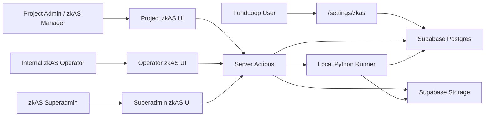

# zkAS v1 Control Plane Architecture

## Summary

zkActivitySum v1 is implemented as a FundLoop-local control plane that coordinates:

- project dataset submission and validation
- operator-run monthly run creation and execution
- superadmin verification and publication
- user-facing published result access
- a local Python execution engine used behind a manifest boundary

The system is split across the Next.js app, Supabase metadata/storage, and a Python runner:

- **Next.js app**: access control, admin/project surfaces, server actions, orchestration
- **Supabase Postgres**: canonical metadata, immutable run snapshots, publication records, analytics rollups
- **Supabase Storage**: raw dataset files, identity artifacts, manifests, result artifacts, attestation artifacts
- **Python engine**: deterministic local execution for development and operator-triggered runs

## Topology

## Roles and Trust Boundaries

### 1. Project Admin

Project admins can manage project membership and may assign `zkas_access` to other project admins.

They cannot:

- approve datasets
- create or execute runs
- verify or publish results
- access TEE artifacts

### 2. zkAS Manager

A zkAS manager is a project admin who also holds the `zkas_access` role through `participant_roles`.

They can:

- access `/projects/[slug]/zkas`
- read the dataset guide
- upload monthly datasets
- inspect dataset validation outcomes
- view aggregate published analytics for their project

They cannot:

- access raw run results
- access `zkas_user_id`
- access attestation or result artifacts
- verify or publish runs

### 3. Internal zkAS Operator

Internal operators are enforced server-side through the `FUNDLOOP_INTERNAL_ADMIN_EMAILS` allowlist.

They can:

- access `/admin/zkas`
- upload identity artifacts
- approve or reject datasets
- create draft runs
- lock runs
- dispatch local execution

They cannot:

- verify completed runs
- publish results to users
- act as zkAS superadmins unless separately allowlisted

### 4. zkAS Superadmin

Superadmins are enforced server-side through the `FUNDLOOP_ZKAS_SUPERADMIN_EMAILS` allowlist.

They can:

- access `/admin/superadmin/zkas`
- review private outputs and artifacts
- verify or reject completed runs
- publish verified results to users
- download result and attestation artifacts through private routes

## Control Plane Flow

### Dataset intake

1. A zkAS manager uploads a CSV or JSON dataset from `/projects/[slug]/zkas`.
2. `app/actions/zkas-actions.ts` stores the raw file in storage and creates a `zkas_datasets` row.
3. `lib/zkas/validation.ts` validates structure, month/project consistency, duplicate rows, and optional-column rules.
4. Validation issues are persisted in `zkas_dataset_issues`.
5. Dataset status moves to `validated` or `failed`.
6. Internal operators approve or reject datasets from `/admin/zkas/uploads`.

### Run creation and execution

1. Operators create a draft run for one month from `/admin/zkas/runs`.
2. The run snapshots approved datasets and confirmed payments into:
   - `zkas_run_datasets`
   - `zkas_run_payments`
3. Locking writes an immutable manifest and stores it in the run bucket.
4. Dispatching downloads the locked inputs and calls the local Python runner.
5. Runner output is persisted into:
   - storage result artifact
   - `zkas_run_results`
   - `zkas_runs` totals and hashes

### Verification and publication

1. Completed runs appear in `/admin/superadmin/zkas`.
2. Superadmin review inspects:
   - manifest hash
   - result artifact hash
   - execution logs
   - attempt mode
   - attestation artifact if present
3. Superadmin marks the run `verified` or `rejected` through `verification_status`.
4. Publishing materializes:
   - `zkas_published_user_results`
   - `zkas_run_project_summaries`
   - `zkas_run_project_cubid_buckets`
   - `user_notifications`
5. The run is marked finalized and published metadata is recorded on `zkas_runs`.

### User access

Published users can view their own verified results at `/settings/zkas`.

The current user-facing record is intentionally minimal:

- month
- aggregate score
- final USD allocation
- publication timestamp

## Schema Layers

### Base v1 schema

The base zkAS schema is introduced in `supabase/migrations/20260326001500_zkas_v1.sql`.

Core tables:

- `zkas_datasets`
- `zkas_dataset_issues`
- `zkas_identity_artifacts`
- `zkas_runs`
- `zkas_run_datasets`
- `zkas_run_payments`
- `zkas_run_attempts`
- `zkas_run_results`

Core enums:

- `zkas_dataset_status`
- `zkas_issue_severity`
- `zkas_run_status`
- `zkas_execution_mode`

### Publication and analytics extension

The superadmin/publication extension is introduced in `supabase/migrations/20260326013000_zkas_admin_ui.sql`.

Additional schema:

- `zkas_verification_status`
- `zkas_published_user_results`
- `zkas_run_project_summaries`
- `zkas_run_project_cubid_buckets`
- additional `zkas_runs` verification/publication fields
- `zkas_run_payments.project_id` snapshot
- `zkas_published_result` notification type

## Shared Interface Boundary

The important architectural boundary is the manifest/result contract rather than the UI.

TypeScript side:

- `types/zkas.ts`

Python side:

- `zkas/engine/zkas_engine/runner.py`

This keeps the app as an orchestration surface while the engine stays replaceable behind a stable input/output shape.

## Key Design Constraints

- Supabase is the control plane and source of truth for orchestration metadata.
- Storage paths are content-addressed enough to support replay and audit.
- Project surfaces only expose aggregate published analytics.
- Verification and publication are orthogonal to execution status.
- The local Python runner is development-grade execution infrastructure; Nitro/TEE integration can be swapped in later behind the same boundary.
