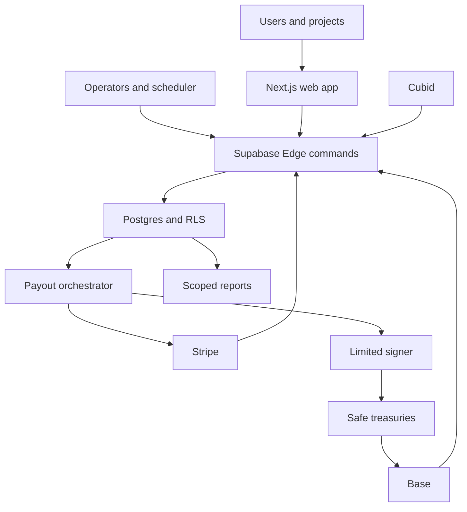

# FundLoop settlement-backed treasury threat model

Status: approved service-context assumptions for Feature #118

## Executive summary

FundLoop is an internet-facing, multi-tenant financial workflow whose highest risks
are forged or replayed settlement evidence, privileged operator or service-role
misuse, ledger-integrity failures, payout reservation races, limited-signer theft,
and cross-project privacy leakage. The target architecture reduces those risks by
allocating only independently observed settled funds, keeping journal writes behind
typed Edge commands and atomic database functions, separating epoch and platform
custody, requiring immutable reconciliation evidence, and constraining automated
Base payouts to $20 per payout, $500 per rolling 24-hour window, and $5,000 per
epoch.

## Scope and assumptions

In scope:

- runtime web, Supabase Edge Function, Postgres/RLS, Stripe, Base, Safe/paymaster,
  Cubid, email, and payout paths introduced or changed by Feature #118;
- existing monthly-cycle, project-payment, allocation, withdrawal, payout,
  reporting, and intake-contract surfaces that the Feature reuses or migrates;
- FundLoop-controlled credentials, secrets, signer authority, provider payloads,
  dependency outages, and incorrect or delayed observations; and
- local, preview, and production configuration differences where they can weaken a
  production boundary.

Assumptions confirmed on 2026-08-08:

- all projects may contribute after affirmatively accepting a versioned
  **experimental** warning;
- the warning is disclosure only and never bypasses KYB/KYC, sanctions, settlement,
  asset allowlist, reconciliation, or allocation gates;
- the Vercel-held limited signer is capped at $20 per payout, $500 across a rolling
  24-hour window, and $5,000 per epoch;
- the public app supports multiple unrelated projects and users through Supabase
  Auth, with project-scoped authorization and pseudonymous cohort views; and
- compromise inside Stripe, Supabase, Vercel, Cubid, Base, or Safe is out of scope,
  while stolen FundLoop credentials, hostile payloads, outage, replay, delay, and
  incorrect provider observations remain in scope.

Out of scope:

- compromise of a managed provider's internal infrastructure;
- production operation before the legal, accounting, custody, Safe, and controlled-
  value launch gates pass;
- chains, fiat, or tokens outside the initial allowlists; and
- CI-only test fixtures unless they can cross into a deployed runtime.

Open questions that can change risk ranking are retained as launch gates in
`settlement-backed-epoch-treasury.md`, including Safe owner threshold, paymaster
budget, production Stripe topology, price sources, and risk-reserve size.

## System model

### Primary components

- Next.js App Router pages and server actions authenticate users and render member,
  founder, and operator workflows. Operator authorization currently relies on
  authenticated Supabase identity plus configured email allowlists
  (`lib/zkas/auth.ts`, `lib/internal-admin-emails.ts`).
- Supabase Edge Functions are the target write boundary. The shared runtime creates
  user-authenticated and service-role clients, validates JSON commands, and can
  authorize selected cron calls with an internal secret
  (`supabase/functions/_shared/command-runtime.ts`).
- Postgres stores multi-tenant workflow state behind RLS. The target ledger,
  external-event, reconciliation, reservation, and epoch tables are append-oriented
  financial records with privileged posting functions.
- Stripe supplies bank-transfer availability, connected-account onboarding, payout,
  webhook, and report evidence. It is not yet implemented in tracked runtime code.
- Base supplies token-transfer and finality evidence. The current intake contract
  allowlists tokens but forwards all deposits to one treasury
  (`contracts/src/FundLoopIntake.sol`).
- Separate Safe smart accounts hold epoch and platform assets. A constrained module
  may authorize the limited signer; master owner keys remain outside application
  infrastructure.
- Cubid supplies identity, whitelist, and uniqueness evidence used at allocation
  gates; projects receive only project-scoped validation results.

### Data flows and trust boundaries

- Internet user or project -> Next.js/Supabase Auth: credentials, profiles,
  invitations, project packages, payout routes, and requests over HTTPS; Supabase
  sessions authenticate the actor, while server/Edge commands enforce project or
  self scope.
- Browser/server -> Edge Function: bearer token plus typed JSON over HTTPS; shared
  runtime authenticates the token, then command-specific validation and role checks
  precede service-role data access (`supabase/functions/_shared/command-runtime.ts`).
- Scheduler -> privileged Edge Function: cron secret plus typed command over HTTPS;
  the secret selects a system actor and therefore requires rotation, replay
  resistance, rate limiting, and environment scoping.
- Stripe/Base/Cubid -> ingestion adapters: signed provider events, chain receipts,
  finality observations, identity evidence, and failure states; every event requires
  provenance, deduplication, freshness, and independent reconciliation.
- Edge Function -> Postgres: service-role queries and security-definer commands;
  balanced posting, idempotency, retained references, consistent locks, and least
  privilege protect financial integrity.
- Postgres -> operator/project/user/public read models: role-scoped reports and
  status projections; raw provider payloads, payout destinations, and cross-project
  identity links must not cross this boundary.
- Payout orchestrator -> Stripe/Safe: destination, asset, native quantity,
  idempotency key, and authorization; no database lock remains open during network
  calls, and paid state requires reconciled external settlement.
- Vercel signer -> Safe module: below-limit Base transaction request; the Safe
  module independently enforces asset, recipient, per-payout, rolling 24-hour
  window, epoch, nonce, expiry, and pause policy.

#### Diagram

## Assets and security objectives

| Asset | Why it matters | Security objective (C/I/A) |
| --- | --- | --- |
| Supabase service-role key and cron secrets | Bypass normal client RLS or invoke privileged automation | C/I |
| Limited Safe signer and module policy | Can move epoch assets within configured limits | C/I/A |
| Safe owner keys and configuration | Control treasury ownership and signer authority | C/I/A |
| Custody balances and settled-event evidence | Define the only allocatable and payable inventory | I/A |
| Ledger transactions, postings, periods, and close hashes | Prove financial completeness and prevent silent value creation | I/A |
| FX, fee, stage, gate, and allocation snapshots | Determine economic outcomes for projects and users | I/A |
| Payout destinations and identity evidence | Sensitive data that can enable theft or correlation | C/I |
| Project packages and Cubid results | Drive inclusion, weighting, and project-specific reporting | C/I/A |
| Terms, warnings, consent, and audit evidence | Prove disclosure and authorized sharing | I/A |

## Attacker model

### Capabilities

- create public user or project accounts, accept the experimental warning, and send
  malformed, duplicated, delayed, or adversarial workflow inputs;
- submit allowed-token transactions and observe public Base activity;
- race requests, replay captured application commands, probe tenant boundaries, and
  induce provider failures or inconsistent event order;
- compromise an ordinary account, project-admin account, browser session, or one
  FundLoop application credential; and
- exploit incorrect authorization, idempotency, numeric, locking, reconciliation,
  or state-transition behavior exposed by FundLoop.

### Non-capabilities

- break standard cryptography or Base consensus;
- compromise the internal infrastructure of a managed provider;
- access master Safe owner keys through the application, because they are not
  stored there; or
- move above configured Safe limits with the limited signer unless the module or
  Safe policy is itself incorrectly configured.

## Entry points and attack surfaces

| Surface | How reached | Trust boundary | Notes | Evidence |
| --- | --- | --- | --- | --- |
| Authenticated web actions | Public HTTPS and Supabase session | Internet -> app | User, founder, invitation, withdrawal, and operator routes | `app/`, `lib/zkas/auth.ts` |
| Edge command runtime | HTTPS POST with bearer token | App -> privileged backend | Creates service-role client after authentication | `supabase/functions/_shared/command-runtime.ts` |
| Cron/admin financial commands | Secret header or admin identity | Scheduler/operator -> backend | Secret mode becomes system actor | `supabase/functions/_shared/admin-payment-operations.ts` |
| Project payment and attribution commands | Authenticated Edge commands | Project -> financial workflow | Public project participation increases abuse volume | `lib/payments/`, `lib/attribution/` |
| Base intake contract | Public Base transaction | Chain user -> treasury | Current version has token allowlist but one treasury | `contracts/src/FundLoopIntake.sol` |
| Provider and chain ingestion | Webhook/report/RPC observation | External provider -> backend | Must authenticate, dedupe, order, and reconcile events | `lib/onchain/payment-reconciliation.ts` |
| Ledger/posting functions | Service-owned database call | Backend -> financial source of truth | Target boundary; direct client writes prohibited | `supabase/migrations/`, Feature #118 design |
| Withdrawal and payout batches | User request then operator/worker execution | User/backend -> provider | Current draft rounds JavaScript numbers and stores destinations in payloads | `lib/withdrawals/`, `lib/execution/payout-batches.ts` |
| Read models and reports | Public/user/project/operator reads | Database -> role-scoped audience | Correlation and destination leakage are primary concerns | `lib/reporting/monthly-cycle-reports.ts` |

## Top abuse paths

1. A project accepts the experimental warning, uploads a manipulated cohort and a
   declared payment, then attempts to enter allocation before settlement. If a
   declaration is treated as cash, unbacked awards are created.
2. An attacker replays or forges a Stripe webhook or Base receipt, causing one
   external movement to be applied to multiple packages or epochs.
3. A compromised operator session or cron secret advances stages, overrides gates,
   or approves a malicious result without the required immutable evidence.
4. A posting or reversal race violates double-entry or consumes the same settled
   event twice, overstating available epoch inventory.
5. Concurrent withdrawal requests reserve the same award or native inventory, then
   create multiple payout attempts before reconciliation catches the mismatch.
6. A stolen Vercel signer submits repeated transfers. Without independent Safe
   limits, the attacker drains an epoch treasury; with the approved limits, loss is
   bounded and detectable.
7. A project or public report exposes a stable Cubid identifier, exact rare cohort,
   or payout destination that correlates one user across projects.
8. A depegged token, stale FX source, provider outage, or incorrect finality
   observation passes a soft gate and causes materially misvalued allocation.

## Threat model table

| Threat ID | Threat source | Prerequisites | Threat action | Impact | Impacted assets | Existing controls (evidence) | Gaps | Recommended mitigations | Detection ideas | Likelihood | Impact severity | Priority |
| --- | --- | --- | --- | --- | --- | --- | --- | --- | --- | --- | --- | --- |
| TM-001 | Malicious project | Public project account and package access | Treat declarations, incomplete packages, or late receipts as allocatable cash | Unbacked or misattributed awards | Custody, allocations, reports | Current project/cycle ownership checks; target settlement-only rule | Current allocator uses declared USD values | Require paired versioned package, independent settled event, warning acceptance, cutoff attribution, KYB/KYC, and hard lock gate | Alert on declared-to-settled variance, late application, and package rollover | high | high | critical |
| TM-002 | Compromised admin session | Admin email/session or service-role path | Approve malicious FX, gates, allocation, or financial posting | Treasury loss and corrupt close | Ledger, custody, close evidence | Supabase Auth plus email allowlist (`lib/zkas/auth.ts`) | Email allowlist alone has no transaction approval policy | Step-up authentication, purpose-specific roles, immutable decision hashes, high-risk Safe threshold, session/device alerts | Alert on new admin device, overrides, manual FX, and unusual stage order | medium | high | high |
| TM-003 | Secret thief or replay attacker | Cron secret exposed through logs/config/request | Invoke privileged reconciliation or stage command repeatedly | Unauthorized automation and denial of service | Stage state, provider events, ledger | Secret-gated system mode and idempotent command direction | Static header comparison and broad CORS; no request signature shown | Environment-scoped rotated secret, HMAC timestamp/nonce, replay table, rate limit, no secret logging | Duplicate nonce, invalid signature, burst, and wrong-environment alerts | medium | high | high |
| TM-004 | Hostile or duplicated external event | Ability to send webhook or reference a transaction | Forge, duplicate, reorder, or mutate settlement evidence | Double application or false settlement | External events, custody, allocations | Existing onchain reconciliation is atomic; target unique external IDs | Stripe adapter absent; current receipt tables are projections | Verify signatures/finality, retain evidence hash, unique provider ID plus custody account, state machine for out-of-order events, statement reconciliation | Duplicate ID, impossible transition, finality regression, and statement mismatch alerts | high | high | critical |
| TM-005 | Application defect or compromised backend | Posting function access | Create unbalanced, duplicate, backdated, or destructive journal entries | Financial source of truth becomes unreliable | Ledger, periods, close package | Target atomic posting/reversal functions and append-only design | Canonical GL not yet implemented | Exact numeric types, balanced deferred checks inside posting function, immutable posted rows, closed-period guard, source conservation, retained FKs, least privilege | Continuous trial balance, orphan source, reversal-chain, and closed-period alerts | medium | high | high |
| TM-006 | Stolen limited signer | Vercel secret compromise | Submit repeated allowed-token transfers | Bounded direct treasury loss | Epoch Safe, payout inventory | Separate Safe direction; master keys absent from app | Safe module not yet configured or independently reviewed | Enforce $20 transaction, $500 per rolling 24-hour window, and $5,000 per epoch in Safe policy; allowlisted tokens/destinations, nonce, expiry, pause, independent review | Safe event monitor at 50/80/100 percent utilization, novel recipient, replay, pause events | medium | high | high |
| TM-007 | Racing user or worker | Valid awards and concurrent requests | Double-reserve credits/inventory or execute duplicate payouts | Overpayment and inconsistent state | Awards, inventory, custody | Current withdrawal credit uniqueness and idempotency (`supabase/migrations/20260805144500_user_withdrawal_requests.sql`) | No partial native inventory reservation or final execution | Consistent lock ordering, atomic commit sequence, exact native lots, unique live intent, short transactions, provider idempotency | Reservation conservation, duplicate destination/amount, stale processing, and negative inventory alerts | high | high | critical |
| TM-008 | Project member or report reader | Authorized access to one project or public output | Correlate pseudonyms, rare counts, raw Cubid state, or destinations across audiences | Privacy harm and identity exposure | Profiles, Cubid, destinations | Existing RLS direction and project membership checks | Target project pseudonyms and anti-correlation transforms absent | Project-specific keyed pseudonyms, audience-specific views, field allowlists, minimum-publication rules, consent versions, privacy regression tests | Cross-project identifier scan, rare-cell report alert, access audit by audience | medium | high | high |
| TM-009 | Dependency outage or faulty observation | Stripe/Base/Cubid/FX source delay or bad data | Cause stale, contradictory, or incomplete evidence during close | Incorrect allocation or frozen operations | FX, identity, settlement, availability | Confirmed fallback/manual FX and hard-gate model | Exact source, freshness, and degraded-mode contracts pending | Fail closed, source quorum/reasonability, immutable manual override evidence, retry queues, explicit delayed-epoch state | Freshness SLO, provider divergence, backlog age, depeg, and gate-duration alerts | high | medium | high |
| TM-010 | Malicious token or contract interaction | Allowed-token configuration error or hostile callback behavior | Exploit intake/sweep/payout contract assumptions | Treasury loss or stuck assets | Base treasuries, intake records | `SafeERC20`, `Ownable`, token allowlist in `FundLoopIntake.sol` | Single treasury and mutable owner-managed allowlist; arbitrary token behavior still possible | Exact deployment allowlist, new versioned dual-purpose intake, pause, reentrancy guard where custody is retained, deployment audit, simulation | Unknown token, treasury change, allowance change, revert-rate, and balance-delta alerts | low | high | medium |

## Criticality calibration

- **Critical:** creates or pays unbacked value, permits repeatable treasury drain,
  or compromises the canonical journal across tenants. Examples: duplicate settled-
  event application, double payout reservation, declaration-derived allocation.
- **High:** enables bounded treasury loss, privileged stage/result manipulation, or
  sensitive cross-project identity exposure. Examples: limited-signer theft within
  limits, operator takeover, stable pseudonym leakage.
- **Medium:** causes recoverable availability loss, bounded misreporting, or requires
  a second control failure for financial impact. Examples: one worker backlog,
  allowlisted token incompatibility, delayed email delivery.
- **Low:** noisy or self-limiting failures with no custody, ledger, identity, or
  authorization impact. Examples: rejected malformed input and public non-sensitive
  metadata enumeration within documented limits.

## Focus paths for security review

| Path | Why it matters | Related Threat IDs |
| --- | --- | --- |
| `supabase/functions/_shared/command-runtime.ts` | Central bearer/service-role and cron-secret trust boundary | TM-002, TM-003 |
| `supabase/functions/_shared/admin-payment-operations.ts` | Converts admin or secret authentication into system financial commands | TM-002, TM-003 |
| `lib/zkas/auth.ts` | Current operator and superadmin authorization model | TM-002, TM-008 |
| `lib/payments/` | Project receipt and admin reconciliation command boundary | TM-001, TM-004 |
| `lib/onchain/payment-reconciliation.ts` | Chain receipt normalization and state advancement | TM-004, TM-010 |
| `supabase/migrations/20260428000500_monthly_cycles.sql` | Existing state and compatibility migration anchor | TM-002, TM-009 |
| `supabase/migrations/20260720190000_project_monthly_contribution_submissions.sql` | Mutable declared contribution source that must not create cash | TM-001 |
| `supabase/migrations/20260721093000_bookkeeping_earnings_credits.sql` | Existing credited-not-paid projection and deletion semantics | TM-005, TM-007 |
| `supabase/migrations/20260805144500_user_withdrawal_requests.sql` | Current reservation idempotency and concurrency boundary | TM-007 |
| `lib/execution/payout-batches.ts` | Payout grouping, rounding, destinations, and deterministic payload | TM-007 |
| `contracts/src/FundLoopIntake.sol` | Public token intake, allowlist, ownership, and single-treasury forwarding | TM-004, TM-010 |
| `lib/reporting/monthly-cycle-reports.ts` | Audience transformation and privacy boundary | TM-008 |
| `supabase/migrations/` | Target immutable ledger, RLS, retained-FK, and queue controls | TM-005, TM-007, TM-008 |

## Quality check

- Covered authenticated user/project/admin, cron, provider/chain, database posting,
  payout, contract, and reporting entry points discovered in scope.
- Represented every identified trust boundary in at least one abuse path and threat.
- Separated production/runtime paths from local, preview, CI, and test fixtures.
- Incorporated the confirmed public-project warning, signer limits, managed-provider
  boundary, and multi-tenant assumptions.
- Kept unresolved provider topology, policy thresholds, and legal/accounting choices
  as explicit launch gates rather than assumed controls.
