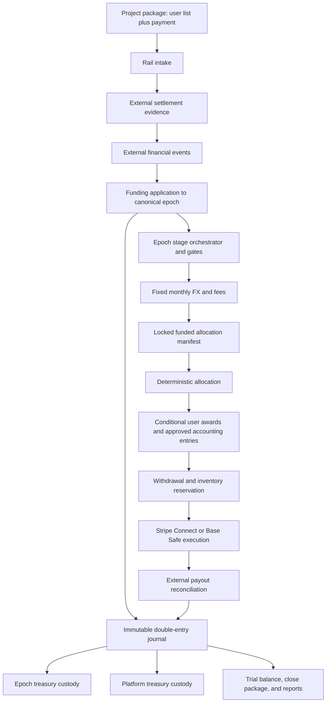
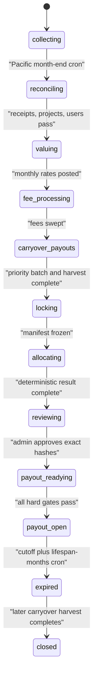

# Settlement-backed epoch treasury and auditable payouts

Last updated: 2026-08-09
Status: implementation architecture for Feature #118; production accounting and
legal activation remain gated by Task #121
Decision source: `agent-context/2026-08-08-epoch-treasury-accounting/sprint-definition.md`
Functional currency: USD
Initial rails: Stripe bank-transfer fiat and Base stablecoins

## 1. Purpose

This document defines the target architecture for monthly FundLoop epochs whose
allocations are backed by cash that FundLoop has actually received. It replaces the
current promise-derived pool boundary with independently reconciled receipts,
separates operational epoch assets from earned-fee platform assets, introduces a
multi-currency double-entry ledger, and closes the outbound loop through auditable
withdrawal and payout execution.

The document is an engineering design, not legal or accounting advice. Before
production custody, FundLoop must obtain professional conclusions about beneficial
ownership, safeguarding, revenue recognition, money transmission, tax, sanctions,
KYC/KYB, chargebacks, and unclaimed-property obligations.

### Superseding legal product intent

FundLoop's latest confirmed product intent is that FundLoop owns project-submitted
funds, submissions are non-refundable as of right, FundLoop is not an escrow
provider, users do not own funds merely because an allocation or payout request
exists, and payout/currency availability is best effort. The platform and epoch
treasury separation is therefore an internal custody and control boundary, not a
representation of user escrow.

That intent conflicts with recognizing user payables at allocation. The engineering
contract therefore records approved allocations in an immutable conditional-award
memorandum subledger, not as user-owned assets or a general-ledger payable. A payout
request reserves an award and inventory but transfers no ownership. The technical
`payout_processed` event occurs only when the selected rail supplies final external
settlement evidence and FundLoop reconciles the exact native movement. Task #121
must obtain counsel and accountant approval of that event and the associated
revenue, expense, tax, and obligation treatment before any production-value posting
policy is activated. Task #127 may implement neutral journal infrastructure and
synthetic balance/reversal tests, but no user-liability account or live economic
posting policy.

## 2. Current codebase baseline

FundLoop already has useful operational foundations:

- `monthly_cycles` and `monthly_cycle_events` model the existing monthly cadence.
- `project_monthly_contribution_submissions` records founder-declared contribution
  inputs.
- `payments`, `onchain_payment_submissions`, `payment_flow_events`, and the onchain
  reconciliation command model inbound payment operations.
- `FundLoopIntake.sol` forwards native or ERC-20 deposits to one configured treasury.
- lock manifests, calculation artifacts, allocation rows, verification, approval,
  and reporting support deterministic monthly calculations.
- `monthly_cycle_bookkeeping_credits` records credited-but-not-paid USD earnings.
- `user_withdrawal_requests` and credit-link rows reserve bookkeeping credits.
- `user_payout_routes`, `user_asset_preferences`, `payout_intents`, batches, items,
  and reconciliation events provide a payout-domain scaffold.
- `lib/execution/` provides rail adapters, but payout execution and reconciliation
  capabilities are currently disabled.
- the local persona harness already exercises founder, member, returning-role, and
  operator workflows and can be extended as checkpoints become real.

The principal gaps are:

1. The calculation package builds contribution pools from submitted amounts rather
   than applied, settled custody receipts.
2. There is no canonical double-entry general ledger or managed chart of accounts.
3. There is no immutable mapping from an external receipt to the project package and
   epoch value it funds.
4. Platform and epoch funds are not represented as separate custody/accounting
   domains end to end.
5. Existing payment timestamps and workflow projections are not sufficient proof of
   economic settlement.
6. Bookkeeping credits, withdrawal reservations, and independently generated payout
   intents can form competing obligation paths.
7. Stripe is a non-executing fiat stub and the outbound adapters do not execute or
   reconcile payouts.
8. Existing monthly-cycle statuses do not express the approved epoch state machine.

## 3. Design principles

1. **Settlement before allocation.** A promise, draft, founder-entered USD amount,
   payment intent, or unfinalized transaction never increases an allocatable pool.
2. **External truth is independently observed.** Stripe balance events/reports and
   Base receipts/finality are ingested as immutable external financial events.
3. **One canonical journal.** Operational tables control workflows; balanced posted
   journals are the financial source of truth.
4. **Native quantity plus functional value.** Every posting preserves exact asset
   units and its USD valuation basis.
5. **Separate purpose custody.** FundLoop-owned epoch assets and earned-fee platform
   assets use separate custody accounts and ledger accounts; neither is described
   as user escrow.
6. **Fixed monthly valuation.** The first-of-month valuation run is the only
   scheduled remeasurement for an epoch. Operational depeg monitoring may pause an
   asset without posting continuous revaluations.
7. **Immutable closing.** Posted journals and locked artifacts are corrected through
   linked reversals, not edits or deletion.
8. **No unbacked payout.** A conditional award cannot be processed unless exact
   native inventory is reserved and external settlement is reconciled.
9. **No parallel obligation paths.** The only payout path is bookkeeping credit to
   withdrawal request to payout intent to batch/attempt to reconciliation.
10. **Retryable, bounded automation.** Stages and external events are idempotent;
    database locks are short and no network call occurs inside a locked transaction.

## 4. Target architecture



The external provider or chain remains the custody truth. The journal records the
accounting truth. Operational projections answer workflow questions without being
allowed to create or erase value independently.

## 5. Canonical epoch state machine



The stage details and approved business rules are maintained in the living Feature
definition. The implementation should represent stage attempts separately from the
current state so retries never erase failed evidence.

### Stage execution contract

Every attempt records:

- epoch and stage;
- deterministic input-manifest hash;
- attempt sequence and idempotency key;
- trigger type and actor;
- start/end timestamps;
- result status and typed reason codes;
- hard- and soft-gate results;
- artifact URIs and hashes;
- superseded attempt relationship; and
- sanitized operational metadata.

Use a transaction-scoped advisory lock per epoch stage. A worker may claim queued
work with `FOR UPDATE SKIP LOCKED`, commit the claim, perform external calls outside
the transaction, and then atomically persist results under an optimistic current-
state guard.

## 6. Canonical cash-flow rules

### Collection cutoff

- The collection cutoff is midnight in `America/Los_Angeles` at calendar month end.
- A Stripe receipt belongs to the epoch in which its funds become available.
- A Base receipt belongs to the epoch in which it reaches the configured finality
  level.
- A project package requires both a valid user list and accompanying settled funds
  before cutoff. If either is missing, both roll to the next epoch.
- Late or past-attributed receipts are never back-posted; they enter the open epoch.
- After cutoff, a project can only approve the frozen package or opt out and roll it
  forward. Silence after accepted reconciliation-email delivery and the deadline is
  approval.

### Fee order

1. For each `project x rail x epoch`, aggregate all settled contributions, then
   assess the project fee exactly once using the epoch's snapshotted percentage and
   apply the per-epoch rail clamp exactly once.
2. Transfer/sweep the project fee to the platform treasury and net assets to the
   epoch treasury.
3. At first-of-month valuation, aggregate post-project-fee assets by rail.
4. Assess the 2.5% base fee per rail and move it to the matching platform treasury.
5. Allocate only the remaining reconciled epoch assets.
6. At payout, deduct the user's snapshotted 0% to 100% selected fee in the chosen
   payout asset and move it to the matching platform treasury.
7. Platform funds pay provider and gas costs, which are recorded as expenses rather
   than hidden deductions from the user's quoted payout.

### Project opt-out

The project fee remains earned once. The net settled contribution and linked user
list roll to the next epoch as a draft package, may be amended before the new
cutoff, and must be revalidated. The same payment is not charged a second project
fee. No base fee is assessed until the package actually enters allocation.

## 7. Monthly FX and asset valuation

### Asset identity

- Fiat: ISO currency code.
- ERC-20: Base chain ID plus exact checksummed contract address.
- Native asset: chain ID plus native marker.
- Metadata: decimals, display symbol, issuer, pegged fiat, activation dates, and
  approved price-source policy.

The initial allowlist is Stripe USD/CAD and Base USDC/USDT/PYUSD. Token symbols
never authorize an asset.

### First-of-month rate process

For every included non-USD asset:

1. fetch the primary source;
2. exhaust documented fallbacks when required;
3. validate freshness, cross-rates, prior-period movement, and peg deviation;
4. precompute valuation and gain/loss impact;
5. present the package for operator review;
6. approve the source set, or allow one admin to enter a manual rate only after all
   configured sources fail; and
7. post and freeze the immutable epoch rate snapshot.

The monthly run records exact source evidence and one fixed USD rate. Receipts may
be initially recognized at settlement spot, but the epoch assets are remeasured
once on the first of the month immediately before fee and allocation calculations.
There is no scheduled daily revaluation.

Operational price monitoring may pause intake or allocation when a stablecoin
leaves the `0.997–1.003` range. Monitoring alone does not post accounting entries.

### FX ownership

The detailed accounting review must distinguish:

- pre-allocation valuation changes that increase or decrease restricted epoch value;
- post-allocation changes after conditional-award USD values are fixed;
- platform-owned asset revaluation; and
- realized differences on payout, conversion, treasury transfer, or rollover.

The system records realized and unrealized FX separately with asset, rail, epoch,
and cause dimensions. User native payout quantity remains based on the originating
epoch's locked rate even if current market value differs.

### Task #135 review implementation

The review-only implementation records append-only ranked FX observations and one
posted snapshot per cycle/asset. Primary observations require rank 1; fallback
observations require a lower rank; a manual rate is accepted only when no fresh,
eligible configured observation remains. USD and supported stablecoins outside
`0.997–1.003` are recorded as `paused_depeg`, never as posted valuation inputs.
Pacific cycle-boundary helpers preserve the actual `America/Los_Angeles` DST
offset. Production is denied independently by Edge runtime and database controls.

Fee processing is source-by-source and exact. A default 1% project fee is bounded
by the selected versioned policy, is set to zero when the source proves it was
already assessed, and precedes the 2.5% base fee. The invariant is stored on every
lot: `gross = project fee + base fee + distributable`. No provider sweep or custody
mutation occurs in this task; the retained asset/custody dimensions are the
reconciliation evidence for later approved posting and transfer work.

Three-cycle expiry is represented by a linked source-lot event. Harvest is rejected
while any exact amount is reserved and succeeds only into a later cycle than the
configured expiry cycle. The successor remains linked to the original package,
source, rail, asset, custody, native amount, FX snapshot, and evidence. Neither
carryover nor returned redistribution residue changes the provisional funded epoch
principal classification or creates a payable/revenue record.

## 8. Multi-currency chart of accounts

The chart is stable and relatively coarse by economic purpose. Asset accounts are
fine-grained only at independently reconcilable custody boundaries. Project, user,
and epoch are posting dimensions, not separate GL accounts.

### Assets

| Code | Account | Purpose |
| --- | --- | --- |
| 1100 | Rail clearing control | Gross funds temporarily held before purpose split |
| 1110 | Epoch treasury fiat | Restricted Stripe/bank balances, child per custody account and ISO currency |
| 1120 | Epoch treasury digital assets | Restricted Base Safe balances, child per token contract |
| 1130 | Platform treasury fiat | Earned platform fiat, child per custody account and currency |
| 1140 | Platform treasury digital assets | Earned platform Base assets, child per token contract |
| 1150 | Payout clearing | Assets submitted to a provider but not yet finally settled |
| 1160 | Platform risk reserve | Designated assets available for post-allocation reversals or disputes |
| 1170 | Project receivables | Recoverable post-allocation chargebacks and reversals |
| 1180 | Unidentified or disputed assets | Externally observed assets not yet safely applied |

### Control, suspense, and conditional-award accounts

Task #121 must approve the final financial-statement classification. The schema
uses immutable machine account keys separately from versioned display codes so an
accountant can approve presentation without rewriting posted identifiers. Accounts
2100, 2110, and 2160 are provisional FundLoop control or classification-suspense
accounts and do not assert beneficiary ownership. Accounts 2120 through 2140 are
memorandum-subledger balances only and never appear in the general-ledger trial
balance. Account 2150 becomes a liability only after FundLoop affirmatively approves
a discretionary refund.

| Code | Account | Purpose |
| --- | --- | --- |
| 2100 | Receipt classification suspense | Settled FundLoop-owned assets awaiting approved accounting classification |
| 2110 | Epoch allocation control | Reconciled, fee-processed FundLoop-owned value designated for an epoch |
| 2120 | Conditional awards memorandum | Approved USD awards with no pre-processing ownership transfer |
| 2130 | Conditional awards on compliance hold | Greylist/blacklist or other authorized holds |
| 2140 | Queued payout memorandum | Approved request awaiting eligible inventory |
| 2150 | Refunds payable | Approved project or user refunds |
| 2160 | Unapplied receipts | Settled external receipts whose beneficiary package is unresolved |

Withdrawal reservation is an operational restriction and does not itself transfer
ownership to a user. It restricts a conditional award and exact native inventory;
it does not create a general-ledger payable.

### Revenue and other income

| Code | Account | Purpose |
| --- | --- | --- |
| 4100 | Project fee revenue | Earned project-and-rail fee |
| 4110 | Base platform fee revenue | Earned 2.5% per-rail epoch fee |
| 4120 | User-selected fee revenue | User-directed payout fee |
| 4200 | Realized FX gains | Gains on asset movement, conversion, payout, or rollover |
| 4210 | Unrealized FX gains | Approved monthly remeasurement gains |

### Expenses and losses

| Code | Account | Purpose |
| --- | --- | --- |
| 5100 | Stripe and banking fees | Intake, transfer, and payout provider costs |
| 5110 | Network and paymaster fees | Base gas and sponsored-transaction costs |
| 5120 | Payout execution fees | Other provider execution costs |
| 5130 | Dispute and chargeback expense | Loss pending or beyond project recovery |
| 5200 | Realized FX losses | Losses on asset movement, conversion, payout, or rollover |
| 5210 | Unrealized FX losses | Approved monthly remeasurement losses |
| 5300 | Bad debt expense | Project receivables approved for write-off |
| 5900 | Rounding and dust | Explicit bounded rounding residuals |

Display account numbers and financial-statement classifications remain a Task #121
approval gate. Immutable machine keys, account classes, normal balance, posting
status, and required dimensions are implementation contracts. Each external custody
account and exact asset receives a controlled child account or account-dimension
combination that reconciles one-to-one to external statements.

## 9. Illustrative journals

The receipt, fee, and custody-transfer examples define required balancing and
provenance, but their income-statement account classification remains a Task #121
approval gate. Allocation itself is memorandum-only because users do not own funds
before payout processing.

The implemented Task #136 local/dev bridge locks only approved project packages
whose fee-processed source lots match a neutral-ledger distributable posting. Its
`settled_cubid_redistribution_v1` artifacts conserve retained initial claims,
score-discount and overlap pool components, source-linked top-ups, and returned
residue. Locking reserves source lots but does not post a user liability, create a
payable, call a provider, transfer value, or enable production allocation.

All examples omit native-unit columns for readability; production postings include
both native atomic units and USD functional value.

### Settled $1,000 project receipt into clearing

| Debit | Credit | USD |
| --- | --- | ---: |
| Rail clearing control | Receipt classification suspense | 1,000.00 |

### 1% project fee and purpose split

| Debit | Credit | USD |
| --- | --- | ---: |
| Receipt classification suspense | Project fee revenue plus provisional contribution-inflow classification | 1,000.00 |
| Platform treasury asset | Rail clearing control | 10.00 |
| Epoch treasury asset | Rail clearing control | 990.00 |

The $990 credit paired with the receipt-classification debit is posted to the
accountant-approved contribution-inflow classification. Until Task #121 approves
that classification, Task #127 tests the journal engine with non-production
synthetic accounts only.

### 2.5% base fee after monthly valuation

| Debit | Credit | USD |
| --- | --- | ---: |
| Project/epoch funds held | Base platform fee revenue | 24.75 |
| Platform treasury asset | Epoch treasury asset | 24.75 |

The remaining restricted pool is $965.25.

### Approved user allocation

Record the approved allocation only in the immutable conditional-award memorandum
subledger. It carries the locked USD value, project attribution, eligible native
inventory, source epoch, expiry, holds, and reservation state, but it creates no
general-ledger posting and transfers no ownership.

### Withdrawal request

No journal is posted merely because a request is created, and the request does not
transfer ownership. The command atomically reserves conditional awards and native
inventory and links them to one payout intent.

### 5% user-selected fee on a $100 claim

| Debit | Credit | USD |
| --- | --- | ---: |
The request snapshots a $5 fee and $95 recipient amount but posts no journal until
the corresponding external movements reach the approved processing event.

### $95 payout through clearing

| Debit | Credit | USD |
| --- | --- | ---: |
At externally reconciled final settlement, one atomic policy transaction recognizes
the accountant-approved $100 distribution expense or equivalent classification,
$5 user-selected fee revenue, the $95 epoch-treasury asset reduction, and any
separate platform/epoch custody transfer needed for the fee. Submitted and
confirming workflow events remain operational evidence and never mark the award
processed by themselves.

### Expired unrequested claim rollover

Expire the remaining memorandum award through a linked immutable event, move the
backing native assets to the receiving epoch dimensions, and recognize only the
accountant-approved monthly valuation and reclassification entries. Never delete
the original award or rewrite its source epoch.

## 10. Proposed canonical data model

Names are provisional; forward migrations must align with existing naming and
generated Supabase types.

### Reference and custody

- `financial_assets`: asset kind, ISO code or chain/contract identity, decimals,
  issuer, peg, status, and effective dates.
- `custody_accounts`: legal owner, treasury purpose, provider/network, external
  redacted identifier, supported asset, control account, active dates, and
  reconciliation policy.
- `ledger_accounts`: account code, parent, class, normal balance, posting/control
  status, functional currency, and effective dates.
- `fee_policies`: fee kind, rail, project override, percentage, USD min/max,
  effective dates, version, and approval evidence.
- `fx_rate_policies`: asset/source priority, reasonability limits, freshness, peg
  tolerance, and effective dates.

### Immutable external and accounting events

- `external_financial_events`: provider/chain, external event ID, event type,
  custody account, asset, exact atomic amount, observed/effective/available/final
  timestamps, raw-evidence hash, payload reference, and dedupe key.
- `ledger_transactions`: type, effective and recorded timestamps, source event,
  idempotency key, actor/trigger, epoch/project/user dimensions, status, reversal
  link, evidence hash, and close period.
- `ledger_postings`: transaction, deterministic position, account, custody/asset,
  debit/credit indicator, exact atomic amount, USD amount, FX snapshot, and required
  dimensions.
- `accounting_periods`: period, open/closing/closed state, close package, approval,
  and reversal policy.

Posted transactions are append-only. A privileged database posting function checks
idempotency, allowed transaction type, account state, required dimensions, exact
USD balance, native-unit constraints, period state, and reversal linkage in one
short transaction.

### Epoch operations

- `epoch_project_packages`: project, intended and canonical epoch, list version,
  payment set, readiness, reconciliation-email delivery, approval/opt-out state,
  rolled-from/to links, and manifest hash.
- `funding_applications`: immutable application of a settled external event amount
  to one project package and canonical epoch. Applied atomic amount cannot exceed
  the settled event's unconsumed amount.
- `epoch_stage_attempts`: idempotent stage attempts and artifact hashes.
- `epoch_gate_results`: hard/soft gate, typed outcome, evidence, actor override, and
  attempt.
- `fx_rate_snapshots` and `fx_rate_observations`: immutable approved monthly rate
  and its primary/fallback/manual evidence chain.
- `fee_assessments`: snapshotted policy, calculation basis, clamp result, journal,
  and treasury transfer state.
- `custody_reconciliation_runs` and items: external opening/movements/closing,
  ledger comparison, native/USD variance, tolerance, classification, and evidence.
- `epoch_close_packages`: immutable artifact index and root hash.

### Identity and allocation

- Extend attribution/user-input snapshots with project-scoped pseudonymous Cubid
  identity, whitelist state, locked Cubid score, versioned locked maximum Cubid
  score, evidence timestamp, expiry, and greylist/blacklist state.
- The lock manifest includes only settled funding applications, approved project
  packages, fixed FX, fee assessments, carryover results, eligible identities, and
  source-preserving asset inventory.
- Each funded project's theoretical share is equal across its eligible users. The
  initial project claim is that share multiplied by `locked score / locked maximum
  score`; it is not weighted by the sum of cohort scores or mutable activity points.
- Baseline is the largest single-project score-adjusted initial claim and cap is
  exact `3 ×` baseline. The canonical minor-unit cap is that exact value floored to
  the allocation minor unit. Before redistribution, aggregate initial claim is clamped to that
  canonical rounding bound, and retained-lot and final-award rounding may never exceed it. If aggregate exceeds the exact cap, every project/source initial lot is scaled by
  `exact cap / aggregate`; each lot's exact difference enters the pool as overlap-cap
  overflow. A zero-baseline user has cap zero, and any user already at cap receives
  no top-up.
- Descending-fraction residual assignment is cap-aware and skips any user/source
  whose next unit would cross the canonical cap. Sub-minor exact residuals and
  rejected candidate canonical units retain original source provenance, may combine
  in the global pool or fund another uncapped user, and otherwise become
  source-linked returned/carryover residue.
- Every theoretical-share score discount and overlap-cap overflow enters one global
  epoch redistribution pool. Exact equal-current users are raised together until
  the next level/cap/exhaustion. Aggregate initial and baseline do not break ties;
  indivisible units use only exact-target fractional remainder then stable user ID.
- Pool source lots and top-up fills preserve project, rail, asset, native quantity,
  FX snapshot, and functional-USD provenance. Cap-exhausted residue returns or
  carries forward through those originating lots.
- Exact and canonical ledgers remain separate. Exact source lots always satisfy
  non-negative `exact initial = exact retained + exact overflow`. Canonical initial
  units are assigned first to the funded canonical total by stable largest
  remainder; constrained retained assignment cannot exceed initial source capacity,
  and canonical overflow is `initial - retained`. Sub-minor residual is tracked
  separately with source provenance, never as negative exact overflow.
- Canonical evidence uses Project A `$300` with scores `5/10/15` of `20`, producing
  `$25/$50/$75` initial claims and `$150` of pool, plus Project B `$1,000` with 100
  users each exactly `10/20`, producing `$500` initial claims and `$500` of pool. The
  three A users also use B, so the combined `$650` goes first to the 97 B-only users
  with the lowest aggregate initial claims.
- Adversarial overlap evidence uses initial lots `[100,100,100,100]`: aggregate
  `$400`, baseline `$100`, cap `$300`, four retained `$75` lots, and four source-linked
  `$25` overflow lots before water-filling. Arbitrary overlap counts must preserve
  the same exact-decimal, minor-unit, native-unit, and input-order invariants.
- Fractional-cap evidence uses four `$0.335` lots: aggregate `$1.34`, baseline
  `$0.335`, exact cap `$1.005`, and canonical cent cap `$1.00`. Four `$0.25`
  retained lots total `$1.00`; exact overflow remains `$0.335`, canonical overflow
  is 34 cents, and the `$0.005` exact-to-canonical residual is tracked separately
  with source provenance. The award never becomes `$1.01`.
  Exact decimals and integer minor-unit outputs conserve independently with no lost
  or double-assigned value.
- Non-negative-lot evidence uses two exact `$0.006` retained lots with a one-cent
  canonical target: assign canonical initial capacity first, retain the cent only
  there, keep both canonical overflow lots non-negative, and reconcile the exact
  `$0.012` ledger separately.
- Equal-current tie evidence uses two exact `$0.005` top-up targets and one cent:
  stable user ID alone selects after equal fractional remainder; aggregate initial
  and baseline never break the tie, and input permutation preserves the result hash.
- Redistribution principal and residue are funded epoch value, never platform fee,
  revenue, a treasury sweep, a user payable, or newly created value.
- Allocation results remain versioned artifacts and projections. The immutable
  conditional-award memorandum is the canonical pre-processing award record; it is
  not a user-owned asset or general-ledger obligation.
- Project/public read models must not expose user-level cross-project membership;
  production calculation and posting remain fail-closed until the named privacy,
  accounting, custody, and launch gates pass.

### Withdrawal and payout

- The non-production review control plane now extends `user_withdrawal_requests`
  through requested, reserved, queued, held, paid, cancelled, and closed states.
  `user_withdrawal_obligations` plus partial claim rows make each minor unit either
  available or assigned to exactly one active terminal path. Claims consume the
  oldest available obligation first and survive inventory expiry when requeued.
- Each request snapshots exactly one active route/destination hash, rail, eligible
  project-linked asset, gross minor amount, 0%-100% user fee, and net amount. The
  review minimum is $10 for Stripe bank transfer and $5 for Base.
- Link exactly one live `payout_intent` path to a fully inventory-backed withdrawal
  request. The database rejects new direct published-result intents; legacy rows
  remain evidence for explicit migration rather than an executable second path.
- `payout_inventory_reservations`: exact atomic units reserved from one or more
  eligible epoch/rail/asset lots at their originating locked FX, deterministic
  cycle/source sequence, expiry/cancellation, and request link. Insufficient
  selected-asset inventory creates a next-epoch queue without a payout intent.
- `payout_execution_attempts`: adapter, batch, signer/provider request, idempotency,
  submitted reference, status, timestamps, and sanitized failure code.
- Extend payout reconciliation with observed native amount, asset, custody account,
  finality/provider status, fee, mismatch classification, and journal link.
- `compliance_holds`: conditional award, Cubid state, reason, notification,
  resolution, and linked release/reversal without exposing raw identity evidence.
- The `withdrawal-operator` and `user-withdrawal-request-create` Edge contracts bind
  authenticated actor and deployment environment server-side. Production runtime,
  provider submission, payables, and value flow remain disabled; current intents
  are review-only drafts and every command returns `noPayoutExecuted=true`.

### Numeric and key rules

- Use `bigint generated ... as identity` for internal single-database primary keys.
- Use time-ordered externally exposed IDs only where required by distributed event
  ingestion; avoid random UUID primary keys on high-write financial tables.
- Store token atomic quantities as `numeric(78,0)` to cover EVM `uint256` values.
- Store functional USD and rates as exact `numeric`, never float.
- Store all timestamps as `timestamptz`; derive Pacific business boundaries through
  explicit timezone-aware functions and versioned calendar rows.
- Add check constraints for non-negative amounts, debit/credit shape, allowed
  statuses, effective date ranges, and source requirements.
- Index every foreign key. Add partial indexes for unresolved events, pending stage
  attempts, open reservations, queued payouts, active holds, and unreconciled items.

## 11. Access control and privacy

1. All new writes use typed Supabase Edge Function commands and service-owned
   database functions. Browsers never post journals or write financial tables.
2. Revoke direct authenticated/anonymous writes to ledger, custody, reconciliation,
   fee, and execution tables.
3. Enable RLS on every exposed table and force RLS where table-owner behavior could
   bypass the intended model.
4. Users read only their own redacted credits, requests, routes, payouts, and holds.
5. Projects read only their project packages and project-scoped pseudonymous cohort
   results. A pseudonym cannot be joined across projects.
6. Public reports contain exact approved project totals and counts but no user
   identifier or cross-project key.
7. Operators receive purpose-specific read models; raw provider payloads, bank data,
   wallet destinations, Cubid evidence, and secret material are excluded unless an
   explicitly authorized operational workflow requires them.
8. Index user/project columns used by RLS. Wrap stable auth calls as scalar
   subqueries and use narrowly scoped `security definer` helpers with an empty
   `search_path` for complex membership tests.
9. Personal profiles are private by default. Public publication is controlled by a
   separate affirmative, versioned, prospectively revocable consent.
10. A project invitation grants no membership or profile visibility. Acceptance is
    required before membership is created and before approved profile fields become
    visible to other authorized members of that project.
11. The privacy policy must state the intended prohibition on sale, rental, and
    voluntary disclosure to unrelated third parties while truthfully disclosing
    necessary service providers, Stripe/Cubid processing, legally compelled
    disclosures, email/hosting infrastructure, and public Base transaction data.
12. Terms, Privacy Notice, public-profile consent, invitation acceptance, and
    material-policy reacceptance are versioned audit records with locale, surface,
    actor, and timestamp.

## 11.1 Legal document and consent implementation boundary

Task #121 may prepare and validate clearly labelled review drafts while neutral
schema, shadow journals, local provider adapters, and consent controls are developed
locally and on `dev`. Drafts are not effective policies and cannot authorize live
value. Before production project submission, allocation, or user payout:

- qualified counsel approves Terms and Privacy Notice for applicable jurisdictions;
- an accountant reconciles the ownership/no-escrow terms with revenue, award,
  expense, and payable recognition;
- a data-flow inventory proves the Privacy Notice matches actual processors,
  retention, public-chain exposure, and role-based sharing;
- project submission requires acceptance of the current Terms and no-refund/best-
  effort disclosures;
- payout setup/request surfaces present best-effort payout and currency-availability
  disclosures without implying ownership transfer at request;
- Stripe connected-account agreements and Stripe privacy disclosures are presented
  where required by the selected Connect configuration;
- profile-publication and invitation-acceptance choices are unbundled from general
  Terms acceptance; and
- withdrawal of public-profile consent stops future public display without erasing
  immutable financial, security, or legal records that FundLoop must retain.

## 12. Rail architecture

### Stripe intake and payouts

Stripe integration uses server-side API calls, signed webhook verification,
event-ID deduplication, idempotency keys, and out-of-order event handling. A receipt
becomes eligible only from independently observed availability evidence, not merely
a successful payment intent.

The retained Stripe Customer Balance bank-transfer implementation remains fail-closed
because the canonical Canadian sandbox exposes no supported push-transfer currencies.
Canadian project funding instead has a distinct one-time PAD rail: Stripe-hosted Checkout,
dynamic payment-method configuration, explicit mandate acknowledgement, delayed settlement,
and authoritative signed-event re-fetch. PAD is not treated as a push transfer, does not reuse
mandates, and cannot fund a package until available custody and a conserved provisional journal
exist. CAD is the safe default; USD stays disabled without exact-account denomination evidence.
See [Stripe Canadian PAD intake](./stripe-canadian-pad-intake.md).

Any Stripe intake rail must prove an exact Stripe/bank arrangement with either separate externally
reconcilable platform and epoch custody identifiers or a clearing account that
sweeps to separate custody within a defined SLA. Production Stripe intake remains
disabled if neither topology is available. Connected-account onboarding uses
Stripe-hosted onboarding; returning from onboarding is not proof of readiness, so
the application checks current account requirements/capabilities or processes
`account.updated` events. Payout completion and failure are reconciled from provider
events and reports.

The sandbox implementation uses a clearing route labelled `clearing_sweep_required`.
Signed availability can create a provisional neutral-ledger receipt and shadow journal,
but absent evidence of the clearing-to-separated-custody sweep remains a visible hard gate
for production activation.

### Base intake

Replace the single-treasury intake assumption with a contract or coordinated
transaction flow that records gross amount, project package, canonical asset, fee
policy/version, platform fee amount, net epoch amount, platform treasury, and epoch
treasury. The contract must only accept allowlisted Base token addresses.

For regular Base transfers, use a documented finality policy. Base documents
increasing guarantees from L2 inclusion through L1 batch finality; production
collection should default to L1 batch finality unless an approved risk policy
selects another level.

### Base payouts

Epoch and platform assets use separate Safe smart accounts. Master owner keys are
never stored in application infrastructure. Below-threshold payouts may use a
Vercel-held limited signer only through an audited Safe allowance/module or
equivalent policy that constrains token allowlist, recipient rules, per-transaction
amount, cumulative interval allowance, expiry, nonce/idempotency, and emergency
revocation.

Safe modules can bypass normal multisignature execution and are security-critical.
Only audited, allowlisted module deployments may be used. Above-policy payouts and
treasury configuration require the configured Safe threshold.

A funded paymaster may sponsor approved user payout transactions. Its own deposit,
allowlist, per-user/epoch limits, depletion alert, and pause switch are operational
controls, not substitutes for the epoch treasury ledger.

Task #140 implements this boundary as `FundLoopSafePayoutModule`, separate epoch/platform
deployments, and the review-only `FundLoopPaymasterBudget`. The epoch Safe is the immutable module
and reimbursement-vault owner, so authorization and policy changes require its threshold. Safe owners authorize exact payout
hashes; a limited signer can execute only those hashes under token, recipient, amount, rolling,
epoch, expiry, nonce, pause, rotation, and revocation checks. Database counters are defense in depth.
Each hash binds the user net transfer, the separately reserved user-fee transfer to the configured
platform Safe, and a bounded native-gas reimbursement; token limits apply to the gross token sum and
the neutral ledger conserves both token legs. Vault depletion reverts the payout atomically.
The typed `base-safe-payout-operator` Edge command owns authorization, optional non-production
signing, viem receipt observation, finality, and the balanced neutral-ledger paid transition.

## 13. Reconciliation and close

For each custody account and asset:

```text
external opening balance
  + settled receipts
  - platform-fee sweeps
  - recipient payouts
  - refunds
  - provider/network fees
  +/- externally observed adjustments
  = external closing balance
```

Compare external closing balance to the corresponding ledger asset balance in
native units and USD. The warning threshold is the larger of $1 or 0.1% for each
`custody account x asset`; it never permits an unexplained difference to disappear.

The close package contains:

- trial balance;
- custody-to-ledger reconciliation;
- project funds roll-forward;
- conditional-award memorandum and compliance-hold roll-forward;
- fee revenue and expense detail;
- fixed FX snapshot and monthly remeasurement;
- funding applications and project rollovers;
- allocation manifest and reproducibility proof;
- payout batch/settlement reconciliation;
- unmatched external events and classified variances;
- stage/gate decisions and admin overrides;
- public/private report artifact index; and
- a root hash linking every immutable artifact.

## 14. Migration and cutover

Task #143 implements the local/non-production migration in the [financial cutover runbook](./financial-cutover-runbook.md). It preserves hashed source classifications and explicit difference reports, routes allocation to reconciled funding applications, routes approved legacy credits to balanced provisional liabilities, and keeps direct published-result payout intents retired. The reversible switch never deletes legacy or canonical evidence and cannot be activated in production.

### Phase A: additive foundation

1. Prepare review-only Terms, Privacy Notice, data-flow, and accounting-recognition
   drafts. Obtain counsel/accountant approval before activating production economic
   postings, definitive policy versions, fund receipt, allocation, or payouts.
2. Add canonical asset, custody, account, external-event, journal, period, and epoch
   attempt/gate tables through forward-only migrations.
3. Keep the existing `monthly_cycle_status` and operational tables as compatibility
   projections while introducing the new stage state.
4. Generate `types/supabase.ts`, update local seed data, and add read-only operator
   views.
5. Run the ledger in shadow mode without changing allocation or payouts.

### Phase B: receipt-backed collection

1. Add Stripe sandbox bank-transfer collection and availability reconciliation.
2. Deploy/test Base intake changes on local chain and Base Sepolia.
3. Ingest both rails into `external_financial_events` and `funding_applications`.
4. Implement paired project package validation, reconciliation email, approval or
   opt-out, and rollover.

The #133 local/dev foundation implements step 4 as a production-disabled preview:
versioned packages bind the approved attribution dataset, payment set, independently
settled funding sources, compliance evidence, and locked CUBID decisions. Missing
list or funding evidence rolls forward; post-cutoff packages freeze before an
accepted local Mailpit delivery can anchor the approve/opt-out/silent-approval
deadline. Project-scoped pseudonyms remain private, while an approved public report
contains only exact project totals and counts. Only approved or silent-approved
packages satisfying every gate enter the shadow lock-candidate view. This does not
enable canonical locking, allocation, payables, provider calls, payouts, or any
production value flow.

### Phase C: epoch cutover

1. Implement monthly FX, fee, reconciliation, carryover, stage, and gate commands.
2. Build lock manifests exclusively from settled funding applications.
3. Run old and new allocation packages in parallel and explain every difference.
4. Switch canonical conditional-award creation only after local and non-production
   equality/backing gates pass.

### Phase D: payout execution

1. Migrate withdrawal requests into the sole obligation path.
2. Introduce exact inventory reservation and queued/carryover behavior.
3. Enable Base Safe and paymaster execution in non-production, then Stripe Connect
   sandbox payouts.
4. Post paid state only from external reconciliation plus balanced journals.

### Existing data

Do not fabricate settlement evidence for historical rows. Backfill them as one of:

- verified external event, when independent evidence is available;
- opening balance with approved evidence and provenance;
- legacy unverified operational record excluded from the canonical ledger; or
- reversed/voided legacy obligation.

Existing bookkeeping credits and payout intents require an explicit one-time
mapping so no conditional award is lost or paid twice. The direct published-result
to payout-intent command must be retired after withdrawal-backed intents are active.

### Migration hazards to handle explicitly

- Do not replace `monthly_cycle_status` in place first. Existing status literals,
  timestamps, pages, commands, tests, and events require an additive compatibility
  projection while the new stage engine rolls out.
- Replace the repeatedly expanded `monthly_cycle_events.event_type` check-constraint
  pattern with a stable versioned event registry or otherwise forward-compatible
  event naming before adding the new stages.
- Do not treat legacy `payments.paid_at` or `confirmed_at` as settlement evidence;
  historical schema defaults populated them at insertion time.
- Do not rewrite legacy cycle attribution derived from `period_end` or submission
  time. Add immutable settlement attribution and classify old rows explicitly.
- Project contribution and attribution upserts currently overwrite singleton rows.
  Introduce append-only package versions before enabling rerunnable validation and
  rollover history.
- Preserve historical lock and calculation artifacts exactly. Normalize new ledger
  references additively without mutating JSON protected by existing hashes.
- Immutable financial rows must not inherit `ON DELETE CASCADE` behavior from
  operational cycle/user/project tables. Use retained references, `RESTRICT`, or
  tombstone identities according to the final retention policy.
- Keep current asset-preference snapshots stable until a versioned preference model
  replaces delete-and-reinsert updates.
- The current intake contract and deployment manifests assume one treasury. Use a
  new contract/deployment version or an explicit reconciled downstream split; never
  silently reinterpret the old treasury address.

## 15. Validation strategy

### Database and pure-domain validation

- migration, reset, seed, and generated-type checks against local Supabase;
- journal-balance and reversal invariants;
- receipt-application conservation and unique external-event ingestion;
- fee clamp, fixed FX, depeg, rollover, and expiry boundary tests;
- property-based allocation conservation by asset and USD;
- concurrent withdrawal/inventory reservation tests;
- RLS tests for user, project, public, operator, and service roles;
- retry/idempotency tests for every stage and provider event; and
- query-plan checks for queue, reconciliation, and user/project read paths.

### Rail validation

- Stripe CLI/sandbox webhook signature, duplicate, out-of-order, availability,
  onboarding, payout failure, and reconciliation fixtures;
- Hardhat contract tests for allowlists, gross/net split, fee limits, treasury
  addresses, pause, reentrancy, and events;
- Base local/Sepolia finality and reconciliation smoke;
- Safe limited-signer allowance, threshold, revocation, replay, and over-limit tests;
- paymaster depletion, policy rejection, and emergency pause tests; and
- no-live-funds tests before any controlled-value pilot.

### Persona and operator validation

Extend the existing local-first harness with required checkpoints for:

- founder validates a paired user-list/payment package, receives reconciliation
  email, approves or opts out, and sees rollover/current allocation reporting;
- new and returning users see Cubid inclusion/failure/remediation, eligible funded
  assets, partial withdrawal, queued inventory, fees, and final reconciliation;
- operator runs all twelve stages, handles hard/soft gates, reviews FX, approves the
  exact calculation hashes, seeds the paymaster, opens payouts, and closes expired
  epochs;
- Stripe USD/CAD and Base USDC/USDT/PYUSD flows; and
- failure paths for late funds, missing list, depeg, Cubid hold, reconciliation
  variance, duplicate webhook, concurrent withdrawal, depleted rail, payout failure,
  and expiry rollover.
- project Terms acceptance and non-refundable/best-effort disclosures;
- private-by-default profile publication and withdrawal of public-profile consent;
- invitation without membership, affirmative acceptance, and project-scoped profile
  visibility; and
- role/provider privacy checks proving the published policy matches runtime data
  disclosure.

Run focused tests first, then the Node 22 `CI=1 pnpm check` gate and the larger local
founder/operator/five-persona matrix. Hosted smoke must remain explicit about which
real provider actions were exercised versus stubbed or sandboxed.

## 16. Operational controls and launch gates

Before controlled production value:

- all projects may contribute only after accepting the current versioned
  experimental warning; acceptance never waives KYB/KYC, sanctions, settlement,
  asset, reconciliation, or allocation gates;
- accountant and counsel approve ownership, no-escrow, no-refund, best-effort,
  conditional-award, revenue/expense/payable, privacy, and custody assumptions;
- versioned Terms and Privacy Notice are published with acceptance/consent evidence;
- Stripe Connect platform, supported countries, capabilities, negative-balance
  responsibility, and payout approach are approved;
- production platform/epoch custody accounts and Safe addresses are verified;
- Safe module/allowance deployment and limited signer are independently reviewed;
  the module enforces $20 per payout, $500 per rolling 24-hour window, and
  $5,000 per epoch, with amounts above $20 requiring Safe threshold approval;
- secrets, rotation, revocation, emergency pause, and incident runbooks are tested;
- price-source hierarchy and manual fallback runbook are approved;
- sanctions/KYB/KYC/Cubid contracts and retention are approved;
- trial balance and custody reconciliation close to zero unexplained variance;
- no allocatable value can be created from declarations alone;
- no user credit can be reserved twice;
- no payout can exceed its reserved native inventory;
- no payout becomes paid without matched external settlement; and
- a zero- or controlled-value pilot completes before limits increase.

## 17. Explicit non-goals for the first release

- Stripe cards or pull-based debit intake;
- fiat currencies other than USD and CAD;
- chains other than Base;
- Base tokens other than allowlisted USDC, USDT, and PYUSD contracts;
- arbitrary user-supplied tokens, chains, price sources, or custody addresses;
- daily or continuous accounting revaluation;
- backdating settled receipts into closed epochs;
- project/user/epoch-specific GL account proliferation;
- automatic conversion into arbitrary payout assets;
- clawback of completed user payouts;
- unattended above-threshold treasury execution; and
- production launch without the legal/accounting/control gates above.

## 18. External design references

- [Stripe Connect overview](https://docs.stripe.com/connect/how-connect-works)
- [Stripe-hosted connected-account onboarding](https://docs.stripe.com/connect/hosted-onboarding)
- [Stripe Connect webhook events](https://docs.stripe.com/connect/webhooks)
- [Stripe connected-account agreement acceptance and privacy disclosures](https://docs.stripe.com/connect/updating-service-agreements)
- [Base transaction finality](https://docs.base.org/base-chain/network-information/transaction-finality)
- [Safe smart-account threshold and modules](https://docs.safe.global/advanced/smart-account-overview)
- [Safe module security model](https://docs.safe.global/advanced/smart-account-modules)
- [Safe allowance/spending-limit example](https://docs.safe.global/home/ai-agent-quickstarts/agent-with-spending-limit)
- [FTC privacy and security guidance](https://www.ftc.gov/business-guidance/privacy-security)
- [Feature #118 repository threat model](./fundloop-threat-model.md)

## 19. Architecture decision register

The architecture separates implementation contracts from deployment configuration
and professional launch approvals. A downstream issue may implement a configurable
boundary while the production value path remains disabled behind its named gate.

| Decision | Locked engineering contract | Remaining owner or launch gate | Blocks |
| --- | --- | --- | --- |
| Pre-processing user ownership | Allocation and request create memorandum awards and reservations only; no user GL payable | Task #121 prepares review options; qualified counsel/accountant approve treatment and the externally reconciled `payout_processed` event before production | Production economic posting and live value, not neutral local/dev implementation |
| Account identity | Immutable machine key, class, normal balance, posting status, required dimensions; display code is effective-dated | Task #121 prepares the recognition memo; the accountant approves presentation and contribution/revenue/expense classification before production | Production chart activation, not neutral Task #127 schema/tests |
| Stripe custody | Every external balance must map one-to-one to a custody account; platform and epoch funds require separate externally reconcilable identifiers or an SLA-bound clearing sweep to separate bank custody | Task #131 selects and proves the available Stripe/bank topology; production remains disabled if neither topology is available | Stripe intake activation |
| Stripe payouts | Stripe-hosted Connect onboarding plus current capability/readiness checks; return URL is never proof of readiness | Task #141 selects account configuration, countries, agreements, and negative-balance policy | Stripe payout activation |
| Base custody | Separate platform and epoch Safe accounts; new versioned intake or explicit reconciled split; old single-treasury deployment is never reinterpreted | Tasks #132 and #140 approve deployments | Base intake/payout activation |
| Limited signer | $20 per payout, $500 per rolling 24-hour window, $5,000 per epoch; token/recipient allowlists, nonce, expiry, pause, and independent Safe enforcement | Task #140 selects Safe owner threshold, audited module deployment, paymaster budget, and alert thresholds | Automated Base payouts |
| FX and depeg | Immutable monthly rate, primary/fallback/manual evidence, reasonability review, and ±0.3% stablecoin pause | Task #135 selects source hierarchy and recovery/reactivation runbook | Valuing and later stages |
| Cubid evidence | Valid and whitelisted IDs only; project pseudonyms; equal theoretical project share discounted by locked score/max; aggregate initials pre-clamped to `3 ×` largest-project baseline with source-linked overflow, then lowest-earner-first global redistribution; grey/black holds | Task #136 selects numeric cache TTL and authorized exception workflow | Allocation lock |
| Project review deadline | Midnight Pacific at the end of the next FundLoop business day after accepted reconciliation-email delivery | Tasks #128/#133 select provider event mapping and versioned holiday rows | Project-package lock |
| Risk reserve | Reversals never silently reduce unrelated awards; losses and receivables are explicit | Tasks #121/#135 set reserve target, chargeback recovery, and bad-debt policy | Controlled production value |
| Rounding and queues | Exact atomic native quantities, exact numeric USD, deterministic sequence, explicit dust, and no negative inventory | Task #139 sets per-asset dust and queued-request terminal policy | Payout opening |
| Public reporting | Exact approved project totals/counts; no user identifiers or cross-project key; publication artifact is immutable | Task #137 sets schema and anti-correlation thresholds with privacy review | Public close publication |
| Legacy migration | Preserve historical hashes and rows; classify every source as verified event, approved opening balance, legacy-unverified record, or reversed/voided record | Task #143 executes and reconciles the mapping in Section 21 | Canonical cutover |

No unresolved provider or accounting choice is required to implement Task #127's
neutral asset, custody, ledger, period, posting, reversal, RLS, and test foundation.
Task #127 may begin after Task #121's review packet is independently validated and
the native blocker reaches `In Review` or beyond. Production posting templates and
live value remain blocked until the professional approval record is present.

## 20. Versioned command and event contracts

All new writes use typed Supabase Edge commands. Every command has this envelope:

```text
contract_version
command_type
idempotency_key
requested_at
actor_scope
resource_scope
payload
```

The Edge boundary authenticates the caller or scheduler, derives actor identity and
role server-side, validates the versioned payload, and passes a typed command to a
short database transaction. Caller-supplied actor IDs, approval timestamps,
settlement state, USD values, and role claims are never authoritative.

Canonical records use these minimum contracts:

### `external_financial_event.v1`

- provider or network, external account/custody account, exact asset ID, external
  event ID, event type, direction, exact atomic quantity;
- observed, provider-effective, available/final, and recorded timestamps;
- evidence URI/hash, provider sequence or block/transaction/log coordinates,
  finality/availability status, supersedes/reverses link, and dedupe key; and
- uniqueness on provider/network plus custody account plus external event ID and
  deterministic sub-position.

One external event may fund multiple packages only through immutable
`funding_applications`; the sum of active applications cannot exceed its settled
atomic quantity.

### `ledger_post.v1`

- transaction type, effective period, source event or approved internal artifact,
  idempotency key, actor/trigger, reversal-of transaction, and evidence hash;
- ordered postings with immutable account key, custody/asset, debit/credit, exact
  native atomic quantity when applicable, exact functional USD, FX snapshot, and
  required project/epoch/user dimensions; and
- database-enforced functional-currency balance, allowed transaction-type schema,
  open-period guard, source conservation, one reversal chain, and append-only posted
  state.

Network calls never occur inside the posting transaction. Every foreign key is
indexed, financial parents use `RESTRICT` or retained/tombstone references, and
partial indexes cover unresolved events and open work queues.

### `epoch_stage_attempt.v1`

- epoch, stage, monotonic attempt sequence, deterministic input-manifest hash,
  trigger/actor, idempotency key, started/completed timestamps, result, reason code,
  artifact hashes, and superseded attempt;
- typed hard/soft gate results with evidence, optional authorized override, and the
  exact transition decision; and
- one transaction-scoped advisory lock per epoch/stage plus optimistic expected-
  state update. Workers claim queue rows with `FOR UPDATE SKIP LOCKED`, commit, do
  external work, then persist results in a new short transaction.

### `conditional_award.v1`

- source allocation/epoch, user, theoretical project shares, locked score/max,
  initial claims, aggregate initial claim, largest-single-project baseline, cap,
  retention factor, retained initial lots, overlap-cap overflow, pre-redistribution
  current, redistribution top-up, final locked USD amount, project/source fills, eligible
  rail/asset inventory, expiry, Cubid evidence, hold state, and immutable result hash;
- available, reserved, queued, processed, expired, and reversed memorandum amounts
  whose conservation equals the approved award; and
- no ownership-transfer or general-ledger-payable semantics before the approved
  externally reconciled processing event.

### `payout_execution_attempt.v1`

- withdrawal request, one rail/asset/destination, reserved native lots, locked FX,
  selected user-fee snapshot, adapter/batch, idempotency key, and sanitized request
  hash;
- created, authorized, submitted, confirming, settled, failed, cancelled, and
  reconciled states with provider/chain reference and typed failure; and
- `processed` only after exact external settlement is matched to the reserved lots,
  fee movement, destination, and accountant-approved balanced journal.

Provider payloads are retained in access-controlled evidence storage, not copied
into public/project/user read models. Commands return a typed success/failure result
and stable error code; retries with the same idempotency key return the original
result or an explicit conflict.

## 21. Legacy migration disposition

Migration is additive and shadow-first. No historical timestamp, declaration, or
hashed artifact is rewritten to resemble settlement evidence.

| Existing surface | Canonical disposition | Cutover proof |
| --- | --- | --- |
| `monthly_cycles` | Retain as compatibility projection; map each cycle to one epoch and derive legacy status from the new stage engine | Old/new state report agrees for every active cycle before write switch |
| `monthly_cycle_events` | Preserve rows; add versioned event registry and links to new attempts rather than extending fragile checks indefinitely | Every new transition has one attempt and compatible legacy projection |
| `payments` | Classify independently; `paid_at` and `confirmed_at` defaults are never settlement proof | Each row is verified event, approved opening balance, legacy-unverified, or reversed/voided |
| `onchain_payment_submissions` and reconciliation events | Preserve raw references and import only independently verified chain observations into external events | Transaction/log/finality coordinates dedupe and reconcile to custody |
| `payment_flow_events` | Retain as operational history; link to canonical external/ledger events without treating it as accounting truth | No orphan canonical event and no operational event creates value alone |
| `project_monthly_contribution_submissions` | Freeze historical singleton rows; create append-only package versions and paired payment applications | Package manifests reproduce submitted history and new reruns never overwrite it |
| attribution datasets and snapshots | Preserve versions/hashes; attach package and project-scoped Cubid evidence | Locked cohort hash and eligibility outcomes reproduce |
| lock manifests, calculation packages, runs, results, verification, approval, reports | Preserve byte-for-byte; new manifests add references without changing protected JSON | Historical hashes remain identical; shadow results explain every difference |
| `monthly_cycle_bookkeeping_credits` | Import as conditional-award memorandum rows with provenance; do not call them settled liabilities | Sum/count/status mapping reconciles and no credit is duplicated or lost |
| `user_withdrawal_requests` and credit links | Import as request/reservation history; create native inventory reservations only after eligibility proof | One live reservation per award portion and original idempotency preserved |
| `payout_intents`, batches, items, reconciliation events | Link withdrawal-backed intents; classify direct legacy intents; retire direct result-to-intent creation after equality proof | One live obligation path and no paid state without external match |
| `user_asset_preferences` | Preserve locked snapshots; replace delete/reinsert behavior only with effective-dated preference versions | Historical payout eligibility remains reproducible |
| `FundLoopIntake` deployments/manifests | Keep historical single-treasury addresses immutable; deploy a new version or record an explicit downstream split | Contract events plus custody movement reconcile gross, fee, and net amounts |

Task #143 produces a row-class count and USD/native roll-forward for each mapping,
plus explicit exception inventory and old/new shadow reconciliation. Cutover is
blocked by any unexplained duplicate, omission, negative inventory, hash change, or
fabricated settlement classification.

## 22. Threat and operational-control decisions

The repository-grounded threat model is
[`fundloop-threat-model.md`](./fundloop-threat-model.md). Its confirmed service
context is part of this architecture:

- all projects may contribute after accepting the exact current version of an
  experimental warning; acceptance is auditable disclosure and grants no control
  bypass;
- public participation is rate-limited and still requires project authorization,
  KYB/KYC/sanctions clearance, paired packages, allowlisted assets, independent
  settlement, Cubid controls, and epoch gates;
- managed-provider internal compromise is out of scope, but FundLoop credential
  theft, hostile/replayed/out-of-order events, outages, delays, and bad observations
  are in scope;
- the limited Safe signer can authorize at most $20 per payout, $500 over a rolling
  24-hour window, and $5,000 in one epoch. Limits are enforced independently by the
  Safe/module; database counters are defense in depth, not the security boundary;
- any payout above $20, module/configuration change, new token, new Safe, signer
  rotation, emergency recovery, or limit increase requires Safe owner-threshold
  approval and an immutable operator record; and
- utilization alerts fire before exhaustion, with an emergency pause that blocks
  new authorization without erasing submitted/reconciliation evidence.

Secrets are environment-scoped and never appear in tracked files or evidence
payloads. Cron commands use replay-resistant timestamp/nonce authentication rather
than a reusable secret alone. Provider webhooks use signature verification,
event-ID deduplication, out-of-order transitions, and statement reconciliation.
Admin decisions use purpose-specific authorization, exact artifact hashes, and
step-up controls for money movement; an email allowlist alone is insufficient for
production treasury approval.

## 23. Implementation readiness and test matrix

Task #127 may begin after Task #121 reaches `In Review` or beyond with a passing
independent validator. Its implementation contract is complete, but every economic
classification stays provisional and production-disabled until qualified approval:

- forward-only migrations for neutral asset, custody, account, period, transaction,
  posting, and reversal foundations;
- `bigint generated ... as identity` internal keys, exact `numeric(78,0)` token
  units, exact numeric USD/rates, `timestamptz`, lowercase identifiers, named checks,
  indexed foreign keys, and targeted partial/composite indexes;
- direct client writes revoked, RLS enabled on exposed read models, `(select
  auth.uid())` and indexed policy columns, narrowly scoped security-definer helpers
  with empty `search_path`, and service-owned posting commands;
- transaction-scoped advisory locks, consistent row-lock ordering, short
  transactions, and `SKIP LOCKED` queue claims; and
- no production account policy, user-payable account, legacy cutover, custody
  mutation, or live external-value movement in Task #127.

| Validation layer | Required proof |
| --- | --- |
| Schema | Local Supabase reset/seed, generated-type diff, exact types/checks/FKs/index inventory, no financial cascade deletion |
| Journal | Balanced and unbalanced cases, idempotent replay, exact numeric conservation, typed reversal, closed-period rejection, source over-application rejection |
| Authorization | Direct anon/authenticated writes denied, service command allowed, user/project/operator read scopes isolated, security-definer search path fixed |
| Concurrency | Duplicate external event, concurrent funding application, stage advisory lock, `SKIP LOCKED` workers, deterministic reservation order, deadlock-order test |
| Epoch | Pacific/DST boundaries, package pairing, late rollover, opt-out deadline, gate transitions, attempt retry and artifact-hash stability |
| FX and fees | Source fallback/manual evidence, ±0.3% pause, first-of-month-only remeasurement, rail fee clamps, no double fee on opt-out rollover |
| Payout | Partial/oldest-first reservation, one rail/asset/destination, depleted queue, $20/$500/$5,000 Safe limits, fee snapshot, failed/retried/final reconciliation |
| Migration | Per-row classification, unchanged historical hashes, old/new shadow totals, no duplicate awards/intents, rollback/feature-flag proof |
| Privacy/UI | Experimental warning acceptance, private profile, invitation opt-in, project pseudonyms, report anti-correlation, desktop/mobile Playwright evidence |
| Integrated | Node 22 `CI=1 pnpm check`, contract tests, local operator/five-persona matrix, sandbox/provider claims labeled exactly |

This Task changes documentation only. Product schema, rail, signer, Safe, payout, and
remote-provider implementation remains owned by the blocked Goal Tasks.

## 24. Provisional award posting and close package

Task #137 adds the local/dev/test-only handoff from an approved funded allocation
to `payout_readying`. The Edge command owns the authenticated actor and runtime,
recalculates the immutable manifest, and refuses approval unless the rerun hash,
persisted result hash, and manifest hash match exactly.

The database creates append-only non-payable award controls and one balanced
provisional neutral-ledger transaction for each positive retained/top-up/source
fill or returned-residue fill. Every posting retains its source project and exact
allocation disposition; the close artifacts retain native asset/custody, FX, fee,
exact USD, canonical minor-unit, and returned-residue evidence.

The root package includes twelve versioned artifact classes: trial balance,
custody, project funds, fees, FX, carryover, initial claims, redistribution pool,
top-ups, returned residue, provisional awards, and exceptions. The immutable
allocation result remains separately bound by its result hash; it cannot replace
the returned-residue class. Public/project
artifacts are aggregate-only; private user evidence is never exposed through those
views, and all public roots, totals, and source/count fields are withheld below the
privacy threshold. Preparation calculates the root but leaves the epoch in
`reviewing`; the same authorized operator must confirm that exact root before the
package records both opt-out-window and approved-close-package hard gates and
advances to `payout_readying`. The existing `payout_readiness_complete` gate remains
between this Goal and any later `payout_open`.

Terminal exact source fills independently conserve each funded source. Any exact
fraction not represented by retained or top-up minor units is recorded as a
source-linked returned-residue fill with zero canonical minor units and a positive
exact-USD ledger amount.

Production close controls are immutable false. No user payable, ownership
recognition, payout intent, provider instruction, custody movement, external call,
or real-value transfer is created.
