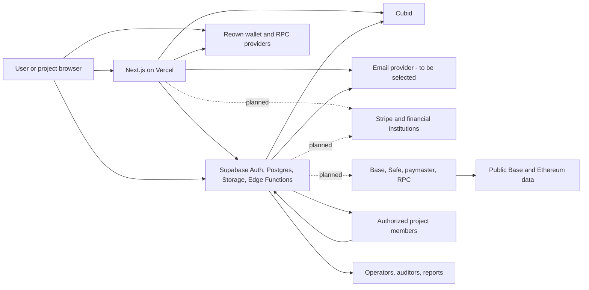

# DRAFT - NOT APPROVED - NOT EFFECTIVE

## FundLoop repository-grounded data-flow inventory

- Status: engineering/privacy review draft
- Entity: Fundloop Canada Inc.
- Snapshot date: August 8, 2026
- Scope: current `dev` repository plus explicitly labelled Feature #118 target flows

This inventory supports the [Privacy Notice review draft](./privacy-notice-canada.md).
`Current` means code/schema exists in the repository; it does not prove a hosted
environment is enabled or that a provider contract applies. `Planned` means Feature
#118 design only and must not be described as live. `Mixed` means an existing
projection or stub will be replaced or extended.

## Inventory method and limits

Reviewed surfaces include `app/`, `components/`, `lib/`, `supabase/functions/`,
`supabase/migrations/`, `contracts/`, provider/config documentation, and the Feature
#118 architecture. Environment secrets and remote provider consoles were not read.
Provider plans, regions, subprocessors, hosted log settings, email transport,
Stripe topology, Base RPC/paymaster, Safe deployment, and production retention are
unverified.

For each flow, implementation must later record: data subject, source, exact fields,
sensitivity, purpose, required/optional status, authority/consent, controller or
processor role, recipients/subprocessors, countries, encryption/key owner,
role access, retention trigger/period, deletion behavior, rights path, breach owner,
and audit evidence.

## System-level flow map

## Detailed processing inventory

| ID | Status | Data subjects and source | Data and repository evidence | Purpose and recipients | Retention/deletion and required control |
| --- | --- | --- | --- | --- | --- |
| DF-001 | Current | Account holder -> Supabase Auth/browser | Email, Auth UUID, identity/session metadata, OTP events and cookies through `lib/supabase.ts`, `lib/supabase-server.ts`, onboarding auth components, and `auth.users` | Authenticate and secure accounts; Supabase and authorized FundLoop runtime/operators | Provider/session settings unverified. Define account closure, security log, backup expiry, access/correction, and breach workflow. Never expose service-role credentials. |
| DF-002 | Current | User -> onboarding/profile | Name, email, avatar/profile URL, bio, headline, gender, occupation, location, interests, wallet-related fields and visibility flags in `users`, reference tables, `user_interests`, onboarding commands, and `components/account/fundloop-profile-panel.tsx` | Private account/profile and optional public discovery; Supabase, FundLoop, public only where current flags permit | Target must be private by default with separate affirmative public consent. Withdrawal removes public discovery promptly but does not erase separately required records. Existing flags are not versioned consent evidence. |
| DF-003 | Current/mixed | Founder/project representative -> onboarding | Organization/project name, website, description, logo/media path, contact, categories, payment methods, onboarding drafts, member roles in `organizations`, `projects`, `organization_members`, `participants`, `participant_roles`, project onboarding commands | Create and administer projects; authorized project members and FundLoop operators | Define draft expiry, inactive-project retention, member removal, public project fields, authority evidence, and audit retention. Several existing writes are migration targets for typed Edge commands. |
| DF-004 | Current | Inviter and invitee -> invitation commands | Invitee email, project, role, inviter, token digest, status, expiry, acceptance actor/time in `project_invitations`, invitation Edge Functions, and acceptance component | Deliver/manual-share invitation and create membership only after matching-email acceptance; project admins and invitee | Raw token is returned once and must not persist or appear in logs/screenshots. Target adds versioned field-sharing disclosure, decline/revocation, and project-scoped profile access. |
| DF-005 | Current | User/project member -> public join/referral | Invitation code, creator, use count, expiry, invited-by attribution in `invitation_codes`, join page, and onboarding commands | Gate signup and attribute referral | Separate legacy signup invitation from project membership invitation. Define expiry/deletion and avoid exposing creator/user linkage publicly. |
| DF-006 | Current | User -> Cubid; Cubid -> FundLoop | Email resolution, Cubid ID, primary identity, status, score, snapshot/provider metadata in `lib/cubid/`, Cubid routes/Edge Functions, `users`, and `cubid_identity_snapshots` | Resolve app identity, display state, and support eligibility/uniqueness | Cubid receives identifiers needed by selected API. Minimize to app-scoped ID/status/score; define TTL, remediation, deletion, provider role/location, and avoid underlying proof ingestion unless required. |
| DF-007 | Planned/mixed | Project -> attribution upload; FundLoop/Cubid -> project review | Active-user references, email/Cubid lookup inputs, project-scoped pseudonyms, validation/whitelist/grey/black state, uniqueness score, dataset versions in current attribution/zkAS tables and planned compliance/package tables | Validate monthly cohort and allocate proportionally; authorized project admins receive only their failures/pseudonyms; affected users receive remediation notices | Current commands query user email/Cubid fields. Target must prevent cross-project correlation, minimize uploaded identity, define score TTL/appeal/hold retention, and review small-cell leakage. |
| DF-008 | Current/mixed | Project -> contribution/payment surfaces; chain/provider -> FundLoop | Declared amount, currency, method, period, status, sender wallet, chain/asset, transaction hash, confirmations/finality, reconciliation events in `payments`, payment drafts, project submissions, `onchain_payment_submissions`, Edge commands | Current operational projection; target independently verifies settlement and maps custody | Stripe intake is not implemented and onchain intake is limited. Provider payloads must be retained privately with hashes/safe projections. Define evidence and dispute retention, role access, and no backdating. |
| DF-009 | Current/mixed | Project/FundLoop -> monthly processing | Cycle, user lists, project payments, Cubid scores, calculation inputs/results, approvals, events, bookkeeping credits, payout intents/batches, reports, zkAS datasets/runs/artifacts across monthly-cycle and zkAS tables/code | Calculate and review allocation, publish role-scoped reports, maintain audit evidence | Current pool uses legacy projections; target uses settled value and immutable artifacts. Pseudonymous and aggregate output can remain personal. Define private artifact access, report thresholds, retention, and legacy classification. |
| DF-010 | Planned | Stripe/financial institution <-> FundLoop/project/user | USD/CAD bank instructions, account/onboarding identifiers, identity/capability requirements, payment/payout/refund/dispute/balance events, fraud/device data, redacted external account, provider IDs | Settlement-backed project intake and user payout through Stripe; Stripe may be processor and independent controller | No production adapter exists. Select Connect/account topology; verify Stripe agreements, privacy disclosures, countries, subprocessors, payload fields, webhook retention, deletion, negative-balance and dispute policy. Never store raw bank credentials. |
| DF-011 | Current/mixed | User -> payout preferences/request | Fiat country/method, chain/asset, redacted destination metadata, wallet address, rank, conditional credits, withdrawal request/reservation, status and idempotency in payout-route/preferences/withdrawal tables and workspace code | Select eligible route, reserve current bookkeeping credits, display request history | Current withdrawal means requested/not paid and does not execute value. Target must separate destinations, exact inventory, holds, queue, cancellation, and settlement; encrypt/restrict destinations and define retention/access. |
| DF-012 | Planned | FundLoop/Safe -> Base recipient; chain -> public | Wallet address, chain/token contracts, native quantity, user fee, nonce, Safe/paymaster request, tx hash, block/finality, failure/replacement/reorg data | Execute and reconcile Base payouts | Public/persistent data is available to anyone and may be correlated. Select RPC/paymaster/Safe providers and logs; warn before route acceptance; avoid publishing offchain identity links; record exact immutable reconciliation. |
| DF-013 | Current | Browser -> Reown/wagmi/RPC | Wallet address/account, selected chain, signatures, RPC requests, AppKit project identifier in `components/web3-provider.tsx`, `lib/onchain/` and public RPC configuration | Connect wallets and support current chain interaction/intake | Reown and RPC provider terms/telemetry are unverified. Inventory selected providers, request logs, IP/device collection, regions, retention, and consent/necessity. Wallet connection is additive, not app identity. |
| DF-014 | Current | User -> FundLoop support; browser -> api.ipify.org | Name, email, subject, message, category, user agent/browser context and public IP fetched by `components/support-page-content.tsx`, stored in `support_requests` | Respond to support and investigate abuse; Supabase, FundLoop, and `api.ipify.org` receive request/IP data | Direct third-party IP lookup is a material disclosure and should be removed or justified/minimized before production. Define ticket/access/attachment retention and privacy-request routing. |
| DF-015 | Current/planned | FundLoop -> users/projects/operators | Auth OTP, invitation links, cycle/reconciliation, hold/remediation, payout, support, security and possible marketing email | Transactional operations and separately consented communications; local tests use Mailpit, production provider is unverified | Choose provider and region/subprocessors. Separate operational/legal messages from commercial electronic messages; record applicable consent/unsubscribe evidence and content retention. Never log OTPs/tokens. |
| DF-016 | Current | Browser/Vercel/Supabase runtime -> logs and observability | IP/request headers, URL, deployment/commit, errors, performance/security events; payment-flow observability uses safe event contracts | Host, secure, debug, and monitor service; Vercel/Supabase/FundLoop | Hosted settings and plan/DPA unverified. Redact secrets, tokens, email, wallet destinations and provider payloads; set access/rotation/export/breach rules and separate optional analytics from essential security. |
| DF-017 | Current | Newsletter visitor -> Supabase | Email and subscription metadata in `newsletter_subscribers` via `components/newsletter-signup.tsx` | Newsletter/commercial communication | Verify explicit consent, source/time/version, confirmation, sender/contact, unsubscribe, suppression, and CASL retention. Do not treat account or Terms acceptance as marketing consent. |
| DF-018 | Current | User/operator -> Supabase Storage/zkAS/reporting | Project media, onboarding attachments, datasets, reports, identity/run artifacts and audit proofs; metadata paths/hashes in storage and app tables | Private workflow artifacts, public project media, audit/reconciliation | `docs/engineering/storage-artifacts.md` defines private-path controls. Inventory bucket visibility, object fields, region, backup, expiry, download logs, deletion/legal hold, and ensure public buckets never contain personal/private artifacts. |
| DF-019 | Current/planned | FundLoop -> administrators/auditors/public | User/project/admin tables, audit log, financial/cycle reports, exports, public project totals/counts | Operate service, investigate, reconcile, report trends | Email allowlists alone are insufficient for high-risk financial approval. Require purpose roles, least privilege, access logs, export controls, pseudonyms, small-cell thresholds, retention, and no public user identifiers. |
| DF-020 | Planned | External authoritative sources -> FundLoop FX/compliance | FX quotes, token price/peg, source timestamp, evidence, sanctions/KYB/KYC results, manual admin decision | Value assets and gate projects/users/rails | Select sources and terms. Retain provenance and override reasons. Do not expose raw screening evidence broadly; define correction/escalation and statutory reporting. |
| DF-021 | Current | Public visitor -> Supabase public storage/CDN | Blog image requests currently reference a public Supabase storage URL in article/blog components | Deliver public content | Request metadata reaches CDN/storage provider. Confirm public bucket contents and caching/log retention; never reuse public bucket for private material. |
| DF-022 | Planned | FundLoop -> professional advisers/regulators/tax authorities | Policy/data inventory, ledgers, provider evidence, identity/compliance, incidents, tax and transaction reports | Legal/accounting review, audit, claims, mandatory reporting | Disclose only necessary records using secure channels, authority logs, retention/legal hold, and notice where permitted. Exact obligations depend on professional classification. |

## Proposed acceptance and consent events

These are implementation contracts for later Tasks, not current live behavior.

| Event | Required evidence | Boundary |
| --- | --- | --- |
| `project_terms_accepted` | actor and project authority; Terms ID/hash/locale/effective version; timestamp/surface; experimental warning; contribution context | Required before submitting project funds; separate from marketing and profile consent. |
| `user_terms_accepted` | actor; Terms ID/hash/locale/effective version; timestamp/surface; protected payout context | Required before payout onboarding/request; request remains not paid and not ownership transfer. |
| `public_profile_published` | actor; consent version; exact fields/scope; locale; timestamp/surface | Optional and unbundled; no preselected public state; prospective withdrawal removes discovery. |
| `project_invitation_accepted` | invitee; project/role; shared field list; policy ID/hash; timestamp; matching-email and invitation ID | No membership or member profile access before atomic acceptance. |
| `commercial_email_consented` | address/actor; purpose; disclosure version; timestamp/source; confirmation where used | Separate from operational messages and general Terms; unsubscribe/suppression evidence retained. |
| `onchain_disclosure_accepted` | actor; chain/asset/destination; disclosure version; timestamp/surface | Required before route use; explains public persistence and correlation risk. |

Every event should have a stable idempotency key and immutable evidence hash.
Material policy changes require a new version; editing display text must not rewrite
prior acceptance.

## Privacy promise crosswalk

| Proposed promise | Inventory evidence | Before approval |
| --- | --- | --- |
| We do not sell/rent personal information or disclose it for unrelated third-party marketing. | No advertising SDK is present in reviewed dependencies; newsletter is first-party Supabase intake. Necessary providers and recipients exist. | Confirm hosted tools and contracts; prohibit provider unrelated use contractually where FundLoop controls it. |
| Profiles are private unless a user opts in. | Existing `users` visibility flags and public discovery surfaces; target consent not yet versioned. | Implement private defaults, separate affirmative event, field scope, withdrawal, and regression tests. |
| Invitations do not create membership before acceptance. | `project_invitations` and atomic acceptance path currently create membership only on acceptance. | Add displayed role/field/policy version, decline/revocation, and project-scoped sharing tests. |
| We disclose information to necessary providers and as required by law. | DF-001 through DF-022 identify current/planned recipients. | Verify exact providers, roles, fields, countries, subprocessors, and lawful processes. |
| Public-chain data cannot be deleted. | Current wallet/RPC and planned Base/Safe flows; Base posts transaction data to Ethereum. | Add prominent pre-route disclosure and minimize offchain identity links. |
| Users may request access/correction and withdraw optional consent. | Support route exists; no complete privacy-rights workflow or verified privacy contact. | Implement authenticated intake, identity verification, response/exception log, processor propagation, and service level. |
| We retain information only as necessary. | Current schemas/artifacts exist; no approved class-by-class schedule. | Counsel/accountant set exact periods and providers confirm backup/log deletion. |

## Open inventory questions blocking production

1. Which Supabase and Vercel regions, plans, DPAs, subprocessors, logs, backups, and
   deletion windows apply?
2. Which email, Stripe, bank, RPC, paymaster, Safe/module, analytics, monitoring,
   sanctions, KYC/KYB, and FX providers will be used in production?
3. What exact fields cross each provider boundary and which provider is an
   independent controller?
4. Why does the support page call `api.ipify.org`, and can server-observed request
   data or no IP collection meet the security need with less disclosure?
5. Which current direct browser/database writes must migrate to typed Edge commands
   before the privacy and authorization promises are true?
6. What exact retention/deletion period applies to each table, bucket, provider log,
   backup, acceptance record, compliance record, and public report?
7. Which reports require small-cell suppression or other anti-correlation rules?
8. What Canadian access, correction, complaint, breach, CASL, RPAA, FINTRAC,
   sanctions, tax, and recordkeeping workflows apply after professional review?

No production privacy claim is approved until these questions are resolved and the
inventory is revalidated against the deployed environment.
