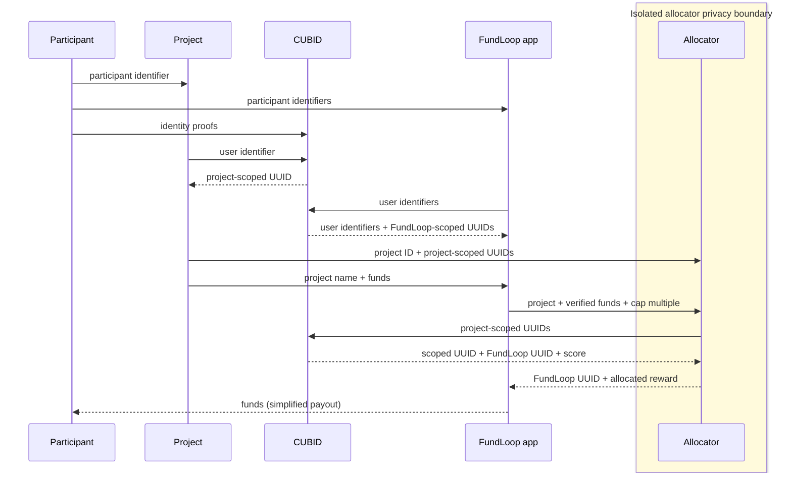
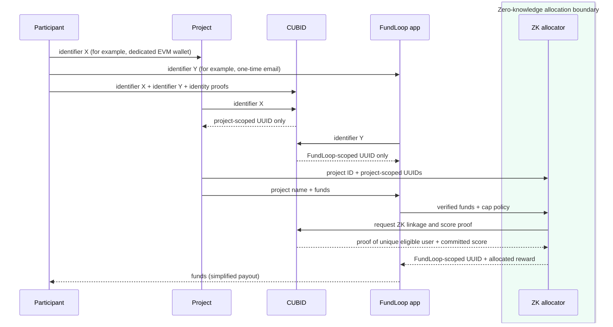
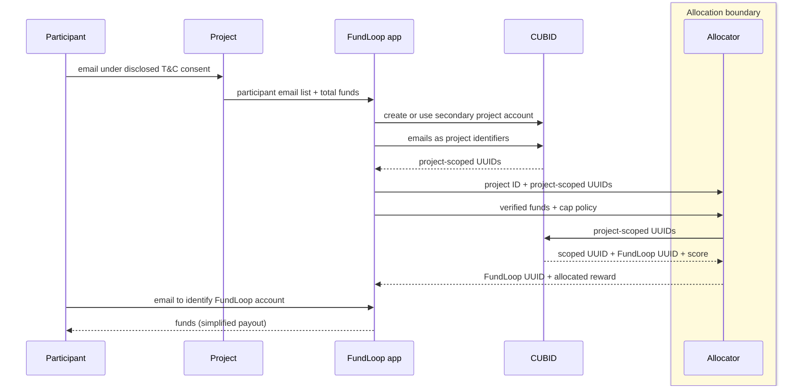

# FundLoop improvement suggestions

Review date: 2026-08-13
Status: product-direction proposal for discussion
Companion document: [FundLoop business red-team critique](./README.md)

## Scope and non-goal

This document responds to the weaknesses identified in the business red-team
critique. It proposes ways to make FundLoop easier to understand, safer to operate,
more honest about its MVP, and simpler for projects and participants to adopt.

It does **not** propose replacing FundLoop's product thesis. FundLoop remains an
opt-in economic network in which projects voluntarily fund rewards for verified
participants, the network coordinates a monthly allocation, and people can receive
value for participating in projects that choose to reward them.

The objective is to preserve that thesis while sharply improving:

- truthfulness about the MVP and the intended privacy transition;
- simplicity at the project and participant boundaries;
- isolation of the sensitive allocation process;
- clarity and predictability of fees and allocation policy;
- reporting as the primary evidence of value;
- integration ergonomics for developers and agents;
- proof through real concierge pilots; and
- discipline about what FundLoop will stop building.

## 1. Product principles

The improvements should be governed by six principles.

### 1.1 Preserve the ambition, narrow the near-term proof

FundLoop may retain its long-term identity as a shared rewards platform, a
privacy-preserving coordination system, a public-goods mechanism, and an
alternative approach to broad economic distribution. The MVP does not have to
prove every part of that future simultaneously.

The near-term proof is narrower:

> Can projects fund a monthly program, submit privacy-minimized participant
> references, let FundLoop calculate a defensible result, and receive trustworthy
> reports while participants successfully collect rewards?

### 1.2 Absorb complexity inside FundLoop

FundLoop's internal architecture may be complex because money, identity, privacy,
reconciliation, and reporting are complex. That complexity should not be exported
to projects or participants.

The external experience should be simple enough to describe in one short paragraph
for each audience. If a founder, developer, or participant must understand the
ledger, allocator, custody topology, or reconciliation state machine to join, the
product boundary has failed.

### 1.3 State the current phase before describing the future

Every public claim should clearly distinguish:

- what is true in the non-zero-knowledge MVP;
- what conventional privacy controls protect today;
- what FundLoop administrators can still see;
- what is experimental or operator-selected;
- what is planned for the full launch; and
- what has been proven in production rather than merely implemented.

### 1.4 Treat experiments as experiments

The current fee positions and dynamic cap multiplier are learning mechanisms. They
should be presented as bounded prototype controls with published decision dates,
not as permanent economic doctrine.

### 1.5 Make reporting the proof layer

FundLoop should not ask projects or participants to trust a complicated mechanism
without intelligible evidence. Reporting should explain the monthly outcome without
exposing the cross-project identity graph.

### 1.6 Stop treating breadth as progress

Additional chains, assets, formulas, governance systems, and agent operations do
not establish product-market fit. Near-term progress means fewer steps for projects,
fewer steps for users, clearer reports, successful real payouts, renewal, and
privacy-preserving evidence.

## 2. Replace the mandatory revenue pledge with voluntary funding choices

The one-percent pledge can remain an important cultural signal and an available
commitment model, but it should not be the mandatory entrance condition for every
project or use case.

Projects should be able to choose a recurring funding policy that fits their
purpose, for example:

- a percentage of revenue;
- a fixed monthly amount;
- a time-limited pilot budget;
- a grant-funded distribution budget;
- a recurring community or contributor reward pool; or
- a one-time funded epoch.

The project profile and reports should identify the selected commitment truthfully.
FundLoop can still recognize projects that voluntarily pledge one percent or more,
but it should not imply that a revenue share is the only legitimate form of
participation.

This broadens the set of credible early adopters without abandoning the voluntary
give-back thesis. It also accommodates organizations that do not have conventional
revenue, including humanitarian programs, foundations, cooperatives, grant-funded
projects, municipalities, and experimental UBI pilots.

The following questions must be explicit during setup:

- What is the funding rule?
- What period does it cover?
- Is the amount fixed, formula-based, or discretionary?
- When does it become final for the epoch?
- What fees apply?
- What happens if funds arrive late or the project opts out?
- What happens to value that cannot be paid?

## 3. Use reward language without promising income

FundLoop should remove words such as **income**, **salary**, and **entitlement** from
its direct product promise unless a specific, legally reviewed context supports
them. These words imply regularity, ownership, enforceability, or employment-like
rights that the MVP does not provide.

Preferred public terms include:

- monthly reward;
- participant reward;
- project-funded reward;
- estimated reward;
- approved reward;
- available reward balance;
- payout request;
- payout sent; and
- payout settled.

The lifecycle should remain explicit:

| Stage | Meaning |
| --- | --- |
| Estimated | A non-final preview based on current inputs. |
| Calculated | The allocator produced a result, but review is incomplete. |
| Approved | The monthly result passed the required review. This label alone must not imply payment. |
| Available | The approved amount is backed and open for a payout request under the applicable rules. |
| Requested | The participant selected an eligible route and requested payment. |
| Sent | A provider or network accepted the payout instruction. |
| Settled | External evidence confirms the final movement of value. |
| Held, failed, returned, or expired | The amount did not settle; the exact reason and next action must be visible. |

Terms such as **salary**, **citizen salary**, **UBI**, and **income** can still appear
in compare-and-contrast material. The distinction should be prominent:

> While nation states are contemplating UBI and citizen salary, FundLoop is
> building an alternative based on opt-in, voluntary, project-funded reward
> mechanisms. FundLoop rewards are not wages, guaranteed income, or a government
> benefit.

Likewise, **entitled** should not be used as shorthand for a calculated or approved
amount. Project reports can instead say which users were **eligible**, which
rewards were **approved**, which became **available**, and which were **settled**.

## 4. Make the landing page belief-based

The home page should explain FundLoop's counter-narrative before listing product
features.

### 4.1 The unspoken compromise in the reward category

Most user-reward systems make at least one of these compromises:

- projects observe and retain detailed user behaviour to prove activity;
- users surrender privacy in exchange for rewards;
- rewards are trapped inside one platform or loyalty silo;
- weak identity controls make programs vulnerable to duplicate accounts and bots;
- strong identity controls expose too much identity to each project;
- projects must build their own allocation and payout machinery;
- a centralized operator makes an opaque decision about who deserves value; or
- reward marketing promises more certainty than the payment system can deliver.

The underlying category belief is often: **useful rewards require surveillance,
closed platforms, or fraud-prone pseudonymity**.

### 4.2 FundLoop's counter-narrative

FundLoop should state a clear alternative:

> Projects should be able to voluntarily share value with real participants
> without building a financial operating system, and people should be able to
> participate across projects without giving every project a complete view of who
> they are or where else they participate.

Supporting beliefs can include:

1. Projects should choose whether and how much value to contribute.
2. People should be rewarded for genuine participation without being required to
   become a public profile or an advertising identity.
3. Proof of humanity should reduce duplication without making identity universally
   visible.
4. Allocation should be reproducible and challengeable, not mystical.
5. A calculated amount is not a payment; the product should say exactly where value
   is in its lifecycle.
6. Projects should receive evidence of the program's operation without receiving a
   cross-project map of participants.
7. Technical complexity should make participation simpler, not more complicated.

### 4.3 Avoid a feature pitch disguised as philosophy

Belief-based positioning becomes hollow if every belief immediately resolves into
a feature list. The landing page should first define the category problem and the
alternative standard. Product mechanics should appear later as evidence that
FundLoop is attempting to satisfy that standard.

The page should not claim that the standard has already been achieved where the MVP
still relies on conventional privacy controls or manual operator decisions.

## 5. Split the public experience into project-facing and participant-facing sites

After the belief-led home page, detailed material should separate into two coherent
audience journeys.

### 5.1 Persistent audience selector

The primary navigation should include a visible selector such as:

```text
[ For people ]  ◉────────○  [ For projects ]
```

The selected side should be unmistakable through:

- a sliding indicator in the navigation;
- a restrained transition when the audience changes;
- distinct audience labels and calls to action;
- an optional subtle colour or illustration shift;
- preserved selection while navigating relevant pages; and
- an accessible, reduced-motion alternative.

This is not two separate brands. It is two views of the same loop. The transition
should visually communicate that people and projects occupy opposite sides of one
shared monthly system.

### 5.2 Home-page role

The shared landing page should contain only:

- the belief and counter-narrative;
- a concise statement of the voluntary monthly loop;
- the honest MVP privacy disclosure;
- the audience selector;
- a short explanation of what FundLoop is; and
- links into the two detailed journeys.

Allocation mechanics, payment setup, integration steps, participant instructions,
reports, and use cases should move into the relevant audience experience.

## 6. Make project participation obviously simple

The project-facing site should lead with the operational simplicity FundLoop is
trying to create:

> Set up your organization profile in a few minutes. Install the CUBID SDK, add one
> project-scoped identifier column to your user model, fund a monthly or recurring
> reward, and send the project-scoped CUBID identifiers for eligible participants.
> FundLoop handles allocation, payout preparation, and privacy-preserving reports
> showing how many participants were scored, approved, made available for payout,
> and ultimately paid.

This copy must be validated against the actual integration. If additional steps are
required for authorization, consent, webhooks, reconciliation, or provider setup,
they should be disclosed rather than hidden. The product goal remains to make the
happy path genuinely match the short explanation.

### 6.1 Project onboarding sequence

The visible setup should be organized into five tasks:

1. **Create the project profile.** Identify the organization, accountable operator,
   public description, and program purpose.
2. **Connect CUBID.** Install the SDK or use an approved integration so the project
   stores project-scoped identifiers rather than global FundLoop identities.
3. **Choose the reward commitment.** Select a fixed amount, percentage, grant
   budget, or pilot budget and a recurrence policy.
4. **Send the monthly cohort.** Submit the project ID and the project-scoped CUBID
   identifiers that qualify under the project's disclosed participation rule.
5. **Review the report.** See validation counts, exclusions, aggregate scores,
   approved rewards, payout availability, settlement totals, and exceptions without
   receiving the cross-project identity graph.

### 6.2 Project-facing use cases

The site should demonstrate the breadth of the thesis through concrete programs,
not abstract platform labels:

- **Local UBI experiment:** an organization creates an opt-in UBI pilot for
  privacy-protected participants in a town or another geo-fenced area.
- **Humanitarian relief:** a relief fund establishes recurring support for verified
  humans in a disaster area while minimizing public identity exposure.
- **Game-player rewards:** a game developer rewards active players while reducing
  duplicate-account farming.
- **Web3 ecosystem rewards:** a foundation rewards active users through a
  Sybil-resistant protocol rather than a wallet-counting airdrop.
- **Recurring startup airdrops:** a startup funds a recurring reward to encourage
  new-user activation and continued participation.
- **Collective distributions:** a cooperative, collective, or membership
  organization distributes earnings or surplus to members pseudonymously.
- **Open-source contributor rewards:** an open-source program operates a recurring
  contributor program without building its own allocation and payout system.
- **Grant-funded public goods:** a public-goods project distributes grant funding
  while protecting participant privacy and preserving auditable aggregate reports.

Each use-case page should state the applicable assumptions. Terms such as UBI,
earnings, relief, and airdrop describe the project program; they must not imply that
FundLoop guarantees income or that every program has the same legal classification.

## 7. Make participant use obviously simple

The participant-facing site should be explainable in one sentence:

> Participate in projects that voluntarily reward people, then come to FundLoop to
> review and collect your monthly reward, including still-available rewards from up
> to the previous three payout months.

The phrase “up to three months later” is ambiguous because it can mean either a
delay or a claim window. Public copy should explain the exact timing with a concrete
example. It should never imply that FundLoop intentionally waits three months to
pay a ready reward if the actual policy is that a reward remains requestable for
three complete payout months.

### 7.1 Participant journey

1. **Use participating projects.** The project explains what activity or membership
   can qualify for its program.
2. **Prove uniqueness through CUBID.** CUBID provides the project with a scoped
   identifier and later gives the isolated allocator the scoped mapping and score.
3. **Open FundLoop.** The participant signs in to see monthly reward state without
   being required to publish a public profile.
4. **Review the explanation.** The participant sees the applicable month, status,
   amount, timing, and any reason a reward is unavailable or held.
5. **Choose an available payout route.** The participant completes only the
   identity and destination steps required for that route and risk level.
6. **Track settlement.** FundLoop distinguishes request, provider acceptance, and
   final settlement.

No user-facing flow should require participants to understand source lots,
water-filling, custody accounts, locked manifests, or cross-project pseudonym
resolution.

## 8. Add “What is FundLoop?” as a multi-answer accordion

The home page should acknowledge that FundLoop can be understood from several
angles. An accordion can give each label a precise meaning and an honest boundary.

| Answer | Explanation and boundary |
| --- | --- |
| Citizen salary | An inspiration and comparison: recurring project-funded rewards can resemble a small citizen dividend, but FundLoop does not promise wages, salary, or guaranteed income. |
| Post-capitalist network state | A long-term social and economic ambition, not a claim that the MVP is a government, jurisdiction, or complete alternative economy. |
| Founder growth engine | A hypothesis that voluntary rewards can improve acquisition, participation, and retention; it must be demonstrated through pilots rather than asserted as proven performance. |
| Shared rewards platform | The clearest current product description: projects fund recurring rewards and FundLoop coordinates private eligibility, allocation, reporting, and payout state. |
| Proof-of-humanity network | A use of CUBID's scoped identity and score signals to reduce duplicate participation; FundLoop should not claim perfect bot prevention or universal personhood proof. |
| Financial operating system | The internal control plane for monthly funding, calculation, review, reconciliation, and reporting—not a bank account or a promise that FundLoop is outside financial regulation. |
| Multi-rail treasury | A description of technical support for more than one value rail; near-term product scope remains one Stripe-backed fiat route and one Safe-backed stablecoin route. |
| Project directory | A discovery surface for projects that participate in the loop, not the primary product or a claim of project endorsement. |
| Agent/MCP platform | A bounded interface through which authorized agents can assist with supported workflows; full agent parity is not a near-term objective. |
| ZK attribution system | The intended privacy destination. The MVP isolates identity amalgamation but is not yet zero knowledge. |
| Public-goods ecosystem | A set of possible programs and participants organized around voluntary circulation of value, not a claim that all listed projects are public goods. |
| UBI distribution engine | Infrastructure that a project or community could use for an opt-in UBI experiment; FundLoop itself does not guarantee or universally provide UBI. |

The accordion should reduce confusion, not celebrate ambiguity. The first expanded
answer should be **shared rewards platform**, followed by the strongest current
plain-language description. Aspirational answers should be labelled as such.

## 9. Isolate the allocation engine as a privacy boundary

The allocator should become a separately bounded module and the only FundLoop
component allowed to amalgamate project-scoped CUBID identifiers into whole-user,
FundLoop-scoped identifiers for allocation.

The boundary should have these properties:

- a separate package or service with a narrowly versioned input/output contract;
- no general application-table access;
- no project-facing access to FundLoop-scoped identifiers;
- no FundLoop application access to project-scoped membership mappings;
- short-lived processing inputs wherever feasible;
- encrypted transport and storage for any retained mapping evidence;
- purpose-specific operator access with immutable audit events;
- explicit retention and deletion rules;
- deterministic calculation artifacts separated from identity mapping artifacts;
- aggregate project reports and private participant reports derived through scoped
  transformations; and
- tests proving that forbidden identifiers cannot cross each interface.

This is not zero knowledge. It is a conventional privacy architecture that proves
FundLoop can isolate the sensitive join, minimize the information returned to the
main application, and stabilize the interfaces that a future ZK implementation
would replace.

The near-term claim should therefore be:

> The MVP uses scoped identifiers, strict service boundaries, encryption, access
> controls, and audited processing to reduce unnecessary cross-project visibility.
> Authorized FundLoop administrators can still access usage and allocation data
> when operating or investigating the MVP. The system is designed so the isolated
> identity join can transition toward zero-knowledge proofs in the full launch.

FundLoop should not claim that this architecture already proves administrators
cannot correlate users. It proves an intentional minimization boundary only after
the deployed data flows, logs, reports, backups, and administrator tools have been
verified against the contract.

### 9.1 High-level information flow



The target minimization is:

- the participant supplies the identifier each project already uses and separately
  supplies the identifiers FundLoop needs for its own account-resolution flow;
- the project knows its own users and its project-scoped CUBID identifiers;
- FundLoop exchanges its submitted user identifiers with CUBID to resolve
  FundLoop-scoped UUIDs, but does not receive project-scoped UUID mappings through
  this account-resolution flow;
- CUBID performs identity proofing and scoped identifier resolution;
- the allocator temporarily sees the project-scoped and FundLoop-scoped mapping
  needed for calculation;
- the main FundLoop application receives its own submitted user identifiers,
  FundLoop-scoped UUIDs, and FundLoop-scoped award output, but not the project's
  scoped UUID mapping or a reusable project-to-project join; and
- reports reveal only the minimum appropriate to the participant, project,
  operator, or public audience.

The schematic is a target information contract. Implementation, logs, support
tools, reporting joins, backups, and incident access must be tested before using it
as a privacy guarantee.

### 9.2 Fully private alias-separation flow for the ZK phase

A participant who wants stronger unlinkability should be able to use two unrelated
identifiers:

- **Identifier X**, known to the project—for example, a dedicated EVM wallet; and
- **Identifier Y**, known to FundLoop—for example, a one-time email address used
  only for the FundLoop account.

The participant gives both identifiers, together with the required identity proofs,
to CUBID. CUBID resolves X only into a project-scoped UUID and Y only into a
FundLoop-scoped UUID. The project never receives Y or the FundLoop-scoped UUID.
FundLoop never receives X or the project-scoped UUID. Neither side receives a
shared CUBID UUID.



Under this design:

- the project can associate participation only with identifier X and its own
  project-scoped UUID;
- FundLoop can associate the account and reward only with identifier Y and the
  FundLoop-scoped UUID;
- CUBID knows that X and Y resolve to the same verified person, but does not return
  that mapping to either administrator group;
- the ZK allocator proves the hidden project-to-FundLoop relationship and score
  conditions without disclosing the project-scoped UUID, identifier X, identifier
  Y, or the cross-scope mapping to FundLoop; and
- reports remain scoped so neither project-facing nor FundLoop-facing output
  introduces a reusable join key.

This removes the direct shared-identifier path that project and FundLoop
administrators could otherwise use to correlate a participant by colluding. It is
reasonable to describe that specific path as having **no available identifier
join** once the ZK design is correctly implemented and verified.

It should not be marketed as literally “zero privacy risk” without stating the
threat model. The guarantee depends on CUBID not disclosing or misusing the X-to-Y
mapping, sound ZK circuits and keys, correct clients, non-identifying reports, and
controls against timing, amount, cohort-size, IP, browser, wallet, support, and
other metadata side channels. Independent review must verify those assumptions
before FundLoop claims administrator-collusion resistance.

### 9.3 Tech-agnostic project flow with consented identifier sharing

Projects without a developer team should have a deliberately simple participation
path. The project sends FundLoop a list of participant email addresses and the total
funds for the reward period. It does not integrate the CUBID SDK, resolve scoped
identifiers, or communicate with CUBID directly.



In the background, FundLoop creates or manages a secondary CUBID account on the
project's behalf and submits the supplied emails as that project's identifiers.
CUBID returns project-scoped identifiers, which FundLoop passes through the same
allocator contract used for integrated projects. This extra translation may appear
superfluous, but it keeps allocator inputs and allocation rules uniform. The
allocator should not need a separate formula or identity model for low-tech
projects.

This path has an explicit privacy tradeoff: FundLoop receives both the participant
email and its association with the project. It is therefore an accessibility path,
not a privacy-preserving substitute for the scoped or ZK flows. It should be
available only when all of the following are true:

- the project's terms and privacy notice clearly say that participant PII will be
  shared with FundLoop for identity resolution, allocation, reporting, and payout;
- each participant must acknowledge that FundLoop will send their email address to
  CUBID for identity resolution and creation of the project's scoped identifier;
- the project has a valid legal basis for the transfer and records the applicable
  participant notice or consent;
- FundLoop and the project have the required data-processing and controller terms;
- the upload uses a secure, access-controlled channel rather than ordinary email or
  an ad hoc spreadsheet link;
- retention, correction, deletion, breach-response, and data-subject-request
  responsibilities are defined; and
- FundLoop makes the lower-privacy character of this route visible in project
  onboarding and participant-facing explanations.

The product benefit is reach: a community organization, cooperative, relief
program, or conventional business can participate without a developer team or any
knowledge of CUBID. Its operational journey becomes: agree to the data-sharing
terms, create a project profile, upload the eligible emails, transfer the period's
funds, and receive the standard FundLoop reports.

The final payout arrows in all three schematics intentionally omit the participant's
reward-request step and any payment-provider processing. They close the conceptual
loop without presenting the diagrams as complete settlement specifications.

## 10. Be bold and specific about the privacy future

The landing page should prominently state the privacy belief:

> Rewards should not require every project to know your complete identity or where
> else you participate. FundLoop is building toward a system in which projects can
> reward verified people using scoped proofs instead of shared identity dossiers.

Immediately nearby, smaller but readable phase disclosure should say:

> MVP privacy notice: the first release is not zero knowledge. It protects users
> with conventional controls including scoped identifiers, access restrictions,
> encryption, private-by-default profiles, limited reports, and audited operations.
> Authorized FundLoop administrators can see usage and allocation data when needed
> to operate, support, investigate, and audit the MVP. The roadmap moves the
> sensitive identity join into zero-knowledge proofs for the full launch.

The disclosure should be repeated at meaningful decision points rather than hidden
only in a privacy policy:

- participant onboarding;
- CUBID connection;
- project integration setup;
- public-profile publication;
- monthly cohort submission;
- reward calculation and reporting; and
- payout setup.

## 11. Treat fee placement as a time-bounded prototype

FundLoop is currently building fee capabilities at the front, middle, and back of
the flow. These controls should be documented as an experimental fee-placement
framework:

- **Front:** a project fee associated with receiving or processing the funded
  project package.
- **Middle:** a base platform fee before allocation.
- **Back:** a participant-selected or payout-stage fee associated with a reward
  request.

The purpose is to learn:

- which party perceives and receives the value;
- where a fee is easiest to explain;
- which fee interferes least with project participation;
- which model can finance compliance and operations;
- how fee placement affects reward size and payout completion;
- whether optional fees are actually chosen; and
- whether projects prefer predictable invoices or value-based charges.

The website and product should not imply that all three positions are intended to
remain. They are prototype capabilities used to compare models.

Within one year, FundLoop should choose and lock a simple fee policy. A plausible
outcome is a predictable project-side fee with payment-provider costs separately
disclosed, but the experiment should determine the answer. The final decision must
include:

- one primary fee payer;
- one readily understood calculation basis;
- documented treatment of provider and network costs;
- no hidden reduction between an approved reward and payout;
- versioned transition rules for existing programs; and
- a public effective date after which the fee model is no longer dynamically
  experimented with in ordinary production programs.

## 12. Treat the admin-controlled cap as a time-bounded policy playground

The dynamic cap multiplier lets an administrator preview and select redistribution
behaviour. During the MVP, this can be useful for learning how different caps affect
concentration, low-reward participants, carryover, and comprehensibility.

It should be described as an interim playground measure, not a permanent source of
monthly discretion.

MVP controls should require:

- a bounded allowed range;
- scenario comparison before selection;
- an immutable record of the selected multiplier and resulting distribution;
- a written rationale;
- disclosure in operator, project, participant, and public reports at the
  appropriate level;
- no change after the epoch locks;
- monitoring for disparate or surprising outcomes; and
- a published date for replacing dynamic selection with a stable policy.

The full launch should use a fine-tuned, predictable multiplier or a narrow
pre-announced rule for changing it. The eventual policy should be set before the
affected participation period wherever possible, so participants do not experience
the reward rule as retrospective discretion.

## 13. Publish a two-phase roadmap

The public roadmap should distinguish the non-ZK experimental MVP from the full
launch and commit to completing the transition in less than one year.

### Phase 1: non-ZK MVP and learning system

Target window: now through 2026 Q4, with real pilot evidence extending into early
2027 if required.

Characteristics:

- conventional privacy controls rather than zero-knowledge proofs;
- an isolated allocator as the only identity-amalgamation boundary;
- authorized FundLoop administrators can access usage and allocation evidence;
- private-by-default participant profiles and audience-scoped reports;
- dynamic, operator-selected cap multiplier with immutable disclosure;
- front-, middle-, and back-fee capabilities available for experiments;
- one Stripe-backed fiat route;
- one Safe-backed stablecoin route;
- concierge operation and support;
- real monthly pilots with complete settlement and reporting evidence;
- no guarantee of income, salary, or universal availability; and
- explicit labels separating estimated, approved, available, sent, and settled
  rewards.

Required learning outputs:

- project willingness to fund and renew;
- participant completion and payout rates;
- comprehensibility of reward explanations;
- privacy concerns and support cases;
- operating cost per project and participant;
- fee-model response;
- cap sensitivity and fairness response;
- provider and settlement reliability; and
- the smallest data contract needed for ZK transition.

### Phase 2: privacy-preserving full launch

Target: complete before 2027-08-13, with an internal target no later than
2027-06-30 to leave contingency inside the one-year commitment.

Characteristics:

- a reviewed zero-knowledge or equivalently privacy-preserving identity and
  eligibility proof replacing the MVP's administrator-visible amalgamation path;
- independently verified guarantees about what projects, FundLoop, CUBID, the
  allocator, and report consumers can learn;
- a fine-tuned and predictable cap policy;
- a simple, locked fee model;
- the same narrow supported fiat and stablecoin routes unless real demand justifies
  expansion after launch;
- production-approved legal, accounting, privacy, custody, tax, sanctions, and
  payment classifications;
- complete participant-, project-, operator-, and public-report contracts;
- published reliability and payout-state definitions; and
- real pilot evidence showing the product is valuable enough to operate.

### Roadmap honesty rule

“Full launch” must not mean that code has merged or a ZK proof runs in a test. It
requires the complete hosted user journey, production data boundaries, professional
approval, external settlement, privacy verification, and public reporting to match
the stated product.

If the ZK transition, fee simplification, or cap stabilization cannot be completed
inside one year, FundLoop should publish the missed gate and resulting product
boundary rather than silently extending the MVP's experimental controls.

## 14. Avoid custody wherever possible

FundLoop should prefer structures in which regulated providers or project-controlled
accounts hold and move value, while FundLoop calculates instructions, records
approvals, and reconciles evidence.

The preferred high-level pattern is:

```text
Project funds a program through an approved provider or project-controlled Safe
    → FundLoop verifies available program funding
    → the isolated allocator calculates approved rewards
    → an authorized instruction is sent to the provider or Safe
    → the provider or network moves value
    → FundLoop records independent settlement evidence
```

FundLoop should avoid representing an internal ledger or omnibus wallet as proof
that user money is safeguarded, owned, or paid. It should not pool assets merely
because the architecture can support pooling.

For the first supported routes:

- fiat should use one Stripe-backed structure selected after legal and provider
  review; and
- stablecoin should use one Safe-backed, allowlisted route with narrow permissions,
  transparent assets, and externally inspectable settlement.

Provider involvement does not automatically remove FundLoop from regulatory scope.
The final contracts, control of instructions, handling of balances, insolvency
treatment, and user relationship must still be reviewed on their facts.

## 15. Make reporting the primary product proof while preserving privacy

Reporting should be the place where FundLoop earns trust and demonstrates value.
The objective is not to publish the complete audit graph. It is to give each
audience enough evidence to understand and challenge the outcome without learning
facts it should not know.

### 15.1 Participant report

Show:

- reward month and project-appropriate source explanation;
- calculation policy version;
- estimated, approved, available, requested, sent, and settled amounts;
- whether an identity or score factor affected eligibility;
- payout route and fee summary without exposing secrets;
- expiry or claim-window dates;
- hold, exclusion, or failure reasons; and
- a correction or support path.

Do not show another participant, cross-project membership, raw CUBID evidence, or
operator-only fraud signals.

### 15.2 Project report

Show:

- funds submitted, verified, fee-processed, allocated, paid, returned, or carried;
- submitted cohort count;
- accepted, unresolved, excluded, and paid participant counts;
- aggregate score or eligibility bands where privacy thresholds permit;
- fee calculation and provider costs;
- cap multiplier and aggregate effect;
- payout completion and exception rates;
- comparison with prior epochs; and
- enough evidence to reconcile the project's program.

Do not return FundLoop-scoped UUIDs, identities from another project, another
project's membership, or a join key that enables correlation.

### 15.3 Operator report

Show the complete operational evidence required to reconcile funds, investigate
exceptions, review identity failures, verify calculations, and close the epoch.
Access should be purpose-limited, logged, and time-bounded where possible.

### 15.4 Public report

Show aggregate funding, eligible-participant bands, settled-reward totals, payout
completion, fees, policy version, cap multiplier, privacy method, and unresolved
exceptions only when disclosure thresholds prevent re-identification.

Public reports should state whether the epoch used the conventional MVP privacy
model or the later ZK model.

### 15.5 Reporting success criterion

A founder and a participant should each be able to explain the result after reading
their report without assistance. That comprehension should be tested during the
concierge pilots rather than assumed.

## 16. Reposition the developer product around a small integration contract

The developer proposition should lead with the shortest path to a working program,
not MCP, architecture, or the internal control plane.

The primary integration contract should expose a small set of stable operations:

1. create or configure a project reward program;
2. obtain or store project-scoped CUBID identifiers;
3. validate and submit a monthly eligible cohort;
4. fund or confirm funding for the epoch;
5. retrieve validation, calculation, and payout-status reports; and
6. receive webhooks for exceptions and settlement.

Developer materials should include:

- one ten-minute quickstart;
- framework-neutral REST contracts or a small SDK;
- exact database-field guidance for the project-scoped identifier;
- test and sandbox identities;
- idempotency and retry rules;
- webhook signatures and replay guidance;
- privacy diagrams and forbidden-data examples;
- copy-pasteable cohort-validation examples;
- a complete sample monthly close; and
- migration guidance for the later ZK contract.

MCP should be an adapter over these stable product APIs. It can help an authorized
agent prepare a project status update, validate a cohort, summarize exceptions, or
assemble a monthly report. FundLoop should not pursue agent parity for every
operation before the core human and API workflows are proven.

## 17. Run a concierge pilot before more platform expansion

FundLoop should recruit a small number of real design partners whose use cases
exercise different parts of the thesis. A useful initial cohort could include:

- one open-source or public-goods contributor program;
- one Web3 or game community concerned about duplicate accounts; and
- one cooperative, relief, local-UBI, or membership distribution program.

Each pilot should run for at least three consecutive monthly epochs. FundLoop staff
may perform manual or semi-manual work, provided the report identifies which steps
were manual and no manual action is presented as automation.

### 17.1 Minimum pilot evidence

Each project must produce:

- a real accountable project operator;
- a disclosed participation and eligibility rule;
- a real funded amount;
- project-scoped CUBID identifiers;
- a validated cohort;
- an immutable cap and fee selection;
- a completed calculation and review;
- available rewards for real participants;
- at least one successful provider- or network-settled payout;
- participant and project reports;
- a reconciliation package;
- support and dispute records; and
- an explicit renewal or non-renewal decision.

### 17.2 Pilot metrics

Measure:

- setup time for the project and developer;
- staff-hours required per monthly close;
- percentage of submitted identities successfully resolved;
- percentage of approved participants who open FundLoop;
- percentage who complete payout setup;
- percentage and value successfully settled;
- median and distribution of reward amounts;
- time from cutoff to available reward and final settlement;
- support cases and disputes per 100 participants;
- participant comprehension of amount, status, and privacy boundary;
- project comprehension of fees, allocation, and reports;
- perceived fairness under different cap scenarios;
- privacy objections or withdrawal requests;
- project-reported changes in participation, retention, or acquisition;
- total operating cost and gross fee revenue per epoch; and
- willingness to renew and pay under the proposed simplified fee model.

## 18. Introduce explicit kill and pivot criteria

Before the first pilot, FundLoop should publish internal continuation criteria so
the team cannot redefine success after observing the outcome.

The program should stop, narrow, or materially redesign if, after three completed
pilot epochs, one or more of these conditions persists without a credible measured
remedy:

- no participating project agrees to renew under a fee that can support the
  service;
- the median available reward is below the relevant payout minimum or is too small
  to motivate completion;
- fewer than 70 percent of approved participants complete payout setup;
- fewer than 90 percent of properly requested rewards settle successfully;
- more than 10 percent of participants dispute eligibility, calculation, or status;
- a typical project requires more than four staff-hours to operate one monthly
  close after initial setup;
- FundLoop requires recurring manual intervention that cannot be financed by the
  expected fee model;
- projects cannot identify measurable value beyond general goodwill;
- the project integration cannot truthfully be completed in the promised simple
  workflow;
- participants cannot correctly distinguish approved, available, sent, and settled
  value after reading their report;
- the conventional MVP privacy model produces unacceptable participant or project
  resistance;
- legal or regulatory requirements make the expected revenue model uneconomic;
- the fee experiments do not identify one understandable, sustainable model;
- cap selection remains too discretionary or produces outcomes users cannot regard
  as legitimate; or
- the proposed ZK transition cannot preserve the required allocation and reporting
  functionality inside the one-year roadmap.

These are not automatic declarations that the entire FundLoop thesis is false. They
are stop conditions for the current product, operating model, or target market.
Crossing one should trigger an explicit decision record rather than another layer
of features.

## 19. Stop-work boundary

Until the concierge pilots establish adoption, meaningful rewards, privacy
acceptance, operational viability, and renewal, FundLoop should stop building:

- additional chains and tokens;
- flatcoins;
- yield-bearing treasury concepts;
- public network-state ambitions;
- generalized governance;
- agent parity for every operation;
- more allocation formulas;
- new payment rails beyond one Stripe-backed fiat route and one Safe-backed
  stablecoin route;
- public participant rankings or cross-project reputation; and
- anything suggesting FundLoop itself guarantees income.

Existing code may be maintained where necessary for safety, reproducibility,
migrations, and current tests. Paused capabilities should be clearly labelled and
kept disabled where appropriate. They should not continue to consume product and
delivery capacity merely because earlier architecture anticipated them.

Exceptions should require a written reason tied to one of the following:

- a security or data-protection requirement;
- a legal or regulatory obligation;
- a blocker for the two supported payment routes;
- a blocker for the isolated allocator or ZK transition;
- a blocker for pilot reporting, settlement, or reconciliation; or
- direct, evidenced demand from a funded pilot partner.

## 20. Decision and evidence register

The roadmap should maintain a public or appropriately scoped register of the
remaining experimental decisions.

| Decision | MVP state | Full-launch commitment | Evidence required |
| --- | --- | --- | --- |
| Funding commitment | Revenue percentage and other voluntary commitments supported | Clear supported commitment types | Pilot adoption and reconciliation evidence |
| Fee placement | Front, middle, and back capabilities available for experiments | One simple predictable model | Willingness to pay, operating cost, completion impact |
| Cap multiplier | Operator-selected within a bounded range | Fine-tuned fixed or narrowly governed policy | Scenario outcomes, fairness and comprehension research |
| Privacy | Conventional scoped controls with authorized-admin visibility | ZK or equivalently verified privacy-preserving join | Threat model, proof design, hosted verification, independent review |
| Custody | Minimized; provider/project-controlled structures preferred | Professionally approved narrow model | Provider contracts, legal classification, insolvency and safeguarding analysis |
| Fiat route | One Stripe-backed route | Same route unless demand justifies change | Hosted settlement and reconciliation evidence |
| Stablecoin route | One Safe-backed allowlisted route | Same route unless demand justifies change | Hosted finality, control, and reconciliation evidence |
| Reporting | Audience-scoped reports with conventional privacy controls | Privacy-preserving reports backed by final proof model | Comprehension, correlation testing, publication evidence |
| Developer interface | Small API/SDK contract; MCP as adapter | Stable ZK-aware integration contract | External integration time and pilot reliability |
| Product viability | Concierge pilots | Repeatable self-serve or supportable operation | Renewal, meaningful reward, completion, cost and margin evidence |

## Closing statement

FundLoop does not need to abandon its thesis to respond to the red-team critique.
It needs to make the thesis easier to enter, more honest about its current phase,
more disciplined about privacy, and demonstrably useful in real monthly programs.

The internal system can remain sophisticated. The promise at its boundaries should
be simple:

- projects voluntarily fund rewards and submit scoped participant references;
- participants prove uniqueness without making a public identity dossier;
- one isolated allocator performs the sensitive join and calculation;
- FundLoop explains exactly what was approved, made available, and settled;
- regulated providers or narrowly controlled accounts move the value wherever
  possible; and
- the MVP's fees, cap policy, and conventional privacy model graduate into a
  predictable, privacy-preserving full launch within one year—or FundLoop reports
  clearly why they did not.
